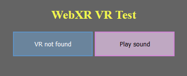

# 3D Sounds

## This article will be dedicated for 3D sounds in VR space.

In the last article we've been going over 3D lighting, in this one we're going to do something pleasing less for the eye, and more for the ear.

When it comes to the topic of 3D sounds themselves; it's a hard topic. While it is simple to make something sound like it's on our left or right side, it's a lot harder to make something sound like it's behind or in front of us (not even getting into how hard it is to make sounds that are on top of and under you). 

So, to go around those struggles, we're going to use a pre-existing library that does all the hard stuff for us! That library will be: [resonance audio](https://resonance-audio.github.io/resonance-audio/).

So to start off, let's import `resonance audio` into our project, that will require us to open `index.html` for the first time, in a long, well, time. We'll simply need to add: 
```html
<script src="https://cdn.jsdelivr.net/npm/resonance-audio/build/resonance-audio.min.js"></script>
```
before any other `script` tag. Now we have succesfully included resonance into our project. So... How do we use it? Well - that's another thing. 

First let's make something that will empower us with the possibility to play sounds. A button will do just fine for now. Of course, later on in this tutorial we are going to add the sounds to the VR part of this application, but for now let's focus on testing if they actually work. 

What's nice about this approach is that we will not have to start up our headsets or phones yet. We will just simply test it out on our PC's, and then go on to implement it into VR.

So let's start off by creating a simple "`Play Sound`" button.
We will, of course, do it in the HTML part of our website.

That goes right after the creation of the first button:
```html
<button id="sound-button">Play sound</button>
```

We can add some style to it in the `<style>` section of course:
```css
#sound-button {
	background-color: rgba(251, 212, 255, 0.603);
	border: rgb(212, 133, 218) 2px solid;
	color: rgb(0, 0, 0);
	height: 50px;
	min-width: 160px;
}
```

This is how our website should look after these modifications:



Now let's code it's functionality of playing a sound effect.

This is the easiest way we can achieve playing a sound:
```js
// resonance globals
let audioContext = new AudioContext();
let resonance = new ResonanceAudio(audioContext);

// Connect the scene’s binaural output (headphones for instance) to stereo out.
resonance.output.connect(audioContext.destination);

// Add the room definition to the scene. We are passing in two objects, both of which i will leave empty for now, so they set to default values.
// The first object defines the room's width, height and length 
// while the second one defines the materials it's walls are made up of.
// For more information you can visit the Resonance Audio's website. :D
resonanceAudioScene.setRoomProperties({}, {});

// Create an HTML AudioElement. It will store the audio source's path.
let audioElement = document.createElement("audio");

// Load an audio file into the AudioElement.
audioElement.src = "irritating_noise.wav"; // You can use any sound you would like to.

// Generate a MediaElementSource from the AudioElement. It will store the audio's source. 
let audioElementSource = audioContext.createMediaElementSource(audioElement);

// The audio input source doesn't really store the audio's source. It's actually responsible for positioning the audio in the scene and passing it correctly to the audio output (playing it).
let source = resonanceAudioScene.createSource();
// We connect it to the MediaElementSource object, so that it knows what audio it actually operates on.
audioElementSource.connect(source.input);

// Set the source position relative to the room center (source default position).
source.setPosition(0.0, 0.0, 0.0);

// Play the audio when the "Play sound" button is pressed.
document.getElementById("sound-button").addEventListener("click", (e) => {audioElement.play();});
```

Great! Now we can hear a sound once we press a button. But we have a couple things to do before we call it finished:

- How do we loop the audio?
- How do we stop it?
- Can we manually set the timestamp that the audio should start from?
- How do we make the audio 3D and dependant on our head's motion?
- How to actually play it in VR mode?

Well, Let me answer all of these questions for you.

You can check out the project's files [here](https://github.com/beProsto/webxr-tutorial/tree/master/projects/tutorial10)!

Previous: [Experimenting with lighting](tutorial9)


<div GITHUB_API_ID="10"></div>


