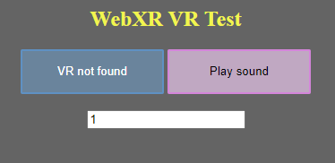

# 3D Sounds

In the last article we've been going over 3D lighting, in this one we're going to do something pleasing less for the eye, and more for the ear.

When it comes to the topic of 3D sounds themselves; it's a hard topic. While it is simple to make something sound like it's on our left or right side, it's a lot harder to make something sound like it's behind or in front of us (not even getting into how hard it is to make sounds that are on top of and under you). 

So, to go around those struggles, we're going to use a pre-existing library that does all the hard stuff for us! That library will be: [resonance audio](https://resonance-audio.github.io/resonance-audio/).

So to start off, let's import `resonance audio` into our project, that will require us to open `index.html` for the first time, in a long, well, time. We'll simply need to add: 
```html
<script src="https://cdn.jsdelivr.net/npm/resonance-audio/build/resonance-audio.min.js"></script>
```
before any other `script` tag. Now we have succesfully included resonance into our project. So... How do we use it? Well - that's another thing. 

First let's make something that will empower us with the possibility to play sounds. A button will do just fine for now. Of course, later on in this tutorial we are going to add the sounds to the VR part of this application, but for now let's focus on testing if they actually work. 

What's nice about this approach is that we will not have to start up our headsets or phones yet. We will just simply test it out on our PC's, and then go on to implement it into VR.

So let's start off by creating a simple "`Play Sound`" button.
We will, of course, do it in the HTML part of our website.

That goes right after the creation of the first button:
```html
<button id="sound-button">Play sound</button>
```

We can add some style to it in the `<style>` section of course:
```css
#sound-button {
	background-color: rgba(251, 212, 255, 0.603);
	border: rgb(212, 133, 218) 2px solid;
	color: rgb(0, 0, 0);
	height: 50px;
	min-width: 160px;
}
```

This is how our website should look after these modifications:


Now let's code it's functionality of playing a sound effect.

We'll start by defining some globals which will give us the ability to create and play those 3D sounds.
```js
// Create an AudioContext
let audioContext = new AudioContext();

// Create a (first-order Ambisonic) Resonance Audio scene and pass it
// the AudioContext.
let resonanceAudioScene = new ResonanceAudio(audioContext);

// Connect the scene’s binaural output to stereo out.
resonanceAudioScene.output.connect(audioContext.destination);

// Add the room definition to the scene. We are passing in two objects, both of which i will leave empty for now, so they set to default values.
// The first object defines the room's width, height and length 
// while the second one defines the materials it's walls are made up of.
// For more information you can visit the Resonance Audio's website. :D
resonanceAudioScene.setRoomProperties({}, {});

// Let's keep track of the number of audios in the scene for absolutely no reason other than that we can assign them ID's based on in what place they were created
let audios = 0;
```

Great! Now it does the exact same thing as before, but with more code! So, we have a couple things to answer before we call it finished:

- How do we create audio?
- How can we play that audio?
- How do we loop the audio?
- How do we stop it?
- Can we manually set the timestamp that the audio should start from?
- How do we make the audio 3D and dependant on our head's motion?
- How to actually play it in VR mode?

Well, Let me answer all of these questions for you.

## First, creating the audio.

You see, even with all the simplicity that `resonance` guarantees us, creating a simple playable audio is still a sort of a pain.

That's why we're going to wrap it all up into a neat class that we can then later use for every sound in our scene.

```js
// This class will contain everything we need for 3D Audio
class PlayableAudio {
```

Now that we have a class, let's give it a constructor. The sounds' constructor should, in my eyes, take in the following arguments:
1. The URL for the audio file itself - We want to be able to actually get the audio from somewhere!
2. The audio's position in the scene - Well, it's a 3D sound, we want to be able to define it's placement in the scene.
3. Wether or not we want the audio to be looped - This is kind of crucial, the answer to wether we need it looped or not will greatly depend on the sound's purpose in the scene.

```js
	constructor(_url, _position, _loop = false) {
```

Now, inside of that constructor we'll have to define every single element of the class.
First comes the ID, that'll be useful for debugging, but isn't necessary and can absolutely - even should - be deleted.

Then we set the url and the position of the sound to the ones passed in.
We do the same for the loop property.

```js
		// We should know which one it is, for debugging purposes
		this.id = audios;
		audios++;
		// It should know where it's audio comes from - we'll have to get the audio from somewhere :D
		this.url = _url;
		// It should know the position from which we'll hear it
		this.posX = _position[0];
		this.posY = _position[1];
		this.posZ = _position[2];
		// We want to know if it's a loop + we want to be able to set it the way we want it
		this.isLoop = _loop;
```

We also want a way to check if the sound is being played - so that we can make sure we're not stopping a stopped sound, playing a playing one, and for other weird scenarios like these;

```js
		// Wether it's playing or not 
		// - playable tells us if the sound isn't currently being stopped, 
		// whilst playing determines wether or not it is, actually, playing
		this.isPlayable = true;
		this.isPlaying = false;
```

Contrary to what the comment i made myself would have you believe, callbacks are actually really helpful!
These are functions that the user (us in this case, lol) can define on their own, that will happen when a certain thing happens.
The names themselves will explain better:

```js
		// These are useless callbacks but whatever
		this.onFinished = () => {};
		this.onStarted = () => {};
```

Now that we have all this, basically, setup, out of the way - we can start actually doing stuff somewhat related to sound!

Here we'll create a resonance audio source - an object which will let our resonance scene influence our audio.

For now we just need to let it know the position we desire for said sound.

```js
		// Create a Resonance source and set its position in space.
		this.source = resonanceAudioScene.createSource();
		this.source.setPosition(this.posX, this.posY, this.posZ);
```

We'll also need two other objects - `buffer` and `bufferSource`.
Buffer will contain the audio data itself. 
The bufferSource however will be responsible for playing and stopping the audio.
We'll need to reload (regenerate, recreate, whatever you want to call it) the bufferSource every time it ends - because once it stops, it won't be able to start again.
If you want to know why - you can read about it [here :D](https://developer.mozilla.org/en-US/docs/Web/API/AudioBufferSourceNode).

```js
		// These will be filled when the sound is loaded
		this.buffer = null;
		this.bufferSource = null;
```

As the last thing to do in the constructor, we'll load the sound up from the url.
We need to:
1. Download it (`fetch` it)
2. Decode audio data from it
3. Use the decoded data in the `buffer` object
4. Generate (create) and audio buffer source from that buffer

```js
		// Now we use the previously saved URL to download, "fetch", the audio from the server
		fetch(this.url).then( // first we retrieve the data hiding behind the url, most likely it'll just be the audio file
			(response) => response.arrayBuffer() // after retrieving the file, we treat it as a buffer or data, at this point it doesn't really matter what data it is
		).then(
			(buffer) => audioContext.decodeAudioData(buffer) // then we get the data we retrieved and finally try and find sound in it
		).then( // if we found sound, as in - if the file contains audio data
			(decodedBuffer) => {
				this.buffer = decodedBuffer;
				this.genBufferSource(); // we create the actual buffer that will be played
			}
		);
```

Now that the last part of the constructor is done, we can finally end it:

```js
	}
```

So, um, earlier we used a function named `genBufferSource`, we'll need to create it now.
It's job will be to create a bufferSource that will use the data supplied by `buffer`.
We'll also have to define what happens when the audio is stopped (either by a user or automatically after it ends (if it's not a loop)).

First, let's create the bufferSource object:

```js
	// Generates the buffer that'll actually be played
	genBufferSource() {
		// Create a buffer source. This will need to be recreated every time
		// we wish to start the audio, see
		// https://developer.mozilla.org/en-US/docs/Web/API/AudioBufferSourceNode
		this.bufferSource = audioContext.createBufferSource();
		this.bufferSource.loop = this.isLoop; // tell it wether we want to loop it or not
		this.bufferSource.connect(this.source.input); // we connect the audio, this will have to be reversed as soon as the audio ends

		this.bufferSource.buffer = this.buffer;
```

Now we'll define what happens when it's stopped - it has a built-in callback for that.
You see, we want to disconnect the bufferSource from the resonance audio scene's source.
We'll also want to delete and regenerate it - as we know already, it'll only play once, after that, so, after it stops, we need to, again, regenerate it:

```js
		// Upon generating the buffer source, we define it's destructor - what happens, when it stops
		// Audio can be ended both by a user (the stop function), and by itself - just reaching the end
		this.bufferSource.onended = () => {
			this.bufferSource.disconnect(); // we disconnect the audio, to get rid of some nasty handlers
			delete this.bufferSource;

			this.genBufferSource(); // we regenerate the buffer source - as we know, it has to be done every time the buffer ends, thus we do it here

			// We set the state to be playable, not playing, so that we can start playing the audio whenever we use the "play" function
			this.isPlayable = true;
			this.isPlaying = false;

			// We call the user-defined callback in case of a sound ending - these seem to be pretty handy, actually! :D
			this.onFinished();

			console.log(`Audio ${this.id} was in fact stopped!`);
		};
	}
```

And with that, we're on to the easier stuff;
We'll want a function to play the audio at hand:
(We only want to play it if it isn't playing already, and if it is playable)

```js
	// Play the audio (with the option of starting at a given time)
	play(_from = 0) {
		console.log(`Audio ${this.id} attempted to be played!`);
		
		// We should only be able to start playing the audio if it isn't playing already, and if it is playable (the cleanup process has finished)
		if(this.isPlayable && !this.isPlaying) {
			this.bufferSource.start(0, _from);

			console.log(`Audio ${this.id} has been indeed played!`);

			// We let the world know that the sound is, indeed, playing
			this.isPlaying = true;

			// We once again, call the user-defined callback, except this time it's for when the audio starts, which is indeed what happened :D
			this.onStarted();
		}
	}
```

Now that we have the option to play the sound, we shall also be able to stop it, at any time we shall wish.
To do that, we need the stop function:

```js
	// Stop the audio 
	stop() {
		console.log(`Audio ${this.id} attempted to be stopped!`);

		// We only stop the audio if it is, in fact, playing AND isn't currently in the process of being stopped
		if(this.isPlayable && this.isPlaying) {
			this.isPlayable = false; // We mark that the audio is in the process of being stopped, thus can't be stopped nor played now

			this.bufferSource.stop(0);

			console.log(`Audio ${this.id} to be stopped!`);
		}
	}
```

We want to do some setters and getters now, first will come the setter and getter for the `loop` variable:

```js
	// These simply let us know and set if the audio is looped
	set loop(_loop) {
		this.isLoop = _loop;
		this.bufferSource.loop = this.isLoop;
	}
	get loop() {
		return this.isLoop;
	}
```

Now we want a getter for how long the audio lasts:

```js
	// This one lets us check the duration of the audio (in seconds)
	get duration() {
		return this.buffer.duration;
	}
```

Now, I think one of the most important ones, a getter and setter for the sound's position:

```js
	// Set and get audio's position
	set position(_pos) {
		this.posX = _pos[0];
		this.posY = _pos[1];
		this.posZ = _pos[2];

		this.source.setPosition(this.posX, this.posY, this.posZ);
	}
	get position() {
		return [this.posX, this.posY, this.posZ];
	}
```

Aaaand we also want to be able to check if the sound is currently playing:

```js
	// Check if the audio is currently playing
	get playing() {
		return this.isPlayable && this.isPlaying;
	}
```

Now we've pretty much finished our 3D audio class, and we can go on to close it:

```js
}
```

So, after all that, we can finally test if it all works! 

Remember how earlier on, we've created another button that'll be displayed on the website?
We want to be able to use it to play a sound!

So let's create a simple test for our audio playing feature, using it!

First let's make the audio:

```js
// Make the audio
let audio1 = new PlayableAudio("/irritating_noise.wav", [0.0, 0.0, 0.0]);
```

You can check the `irritating_noise.wav` file out [here](https://github.com/beProsto/webxr-tutorial/blob/main/projects/tutorial10/irritating_noise.wav), if you don't have one to test!

Great! We have created a sound! Now what?

Well, now we use the button we defined earlier to play it!
Like this:

```js
// We get the button via it's ID
const playButton = document.getElementById("sound-button");

// When it's clicked - we play the sound
playButton.onclick = (e) => {
	// This function allows our application to play sounds. We have to do it inside a user initiated event - that's why we're doing it here. No worries tho, we'll have it inside the "Enter VR" button's onclick function
	audioContext.resume(); 

	// We play the audio from the start, till the end.
	audio1.play();
};
```

Now, if we've done everything right, we should be able to just go and play the sound on our web application. 

Remember - if you've had any problems with this tutorial up until this point, including here, you can always feel free to just ask in the comments!

Anyhow, if it works - great! It works! We should now be in position to test out other functions, like stopping the sound on the fly:

```js
// Play the audio. (shall the user so wish)
const playButton = document.getElementById("sound-button");
// A simple toggle between the states of wanting to stop and play the audio
playButton.onclick = (e) => {
	// We have to do it inside an event! No worries tho, we'll have it inside the "Enter VR" button's onclick function
	audioContext.resume(); 

	// A simple toggle
	if(playButton.innerHTML == "Play sound") {
		playButton.innerHTML = "Stop sound";

		// Play the audio
		audio1.play();
	}
	else {
		playButton.innerHTML = "Play sound";

		// Stop the audio
		audio1.stop();
	}
};

// When audio finishes we want to automatically reset to a play button
audio1.onFinished = () => { playButton.innerHTML = "Play sound"; };
```

Or, expanding on that even further, adding a number input to our site that'll let us decide the precise time from which we'll want the sound to begin:

```html			
			<br><br>
			<input id="sound-time" type="number" step="0.1" value="0">
```

We add that right under where we added our play button. :p

Now, let's use it to play the sound from a specific time:

```js
// Play the audio. (shall the user so wish)
const playTime = document.getElementById("sound-time");
const playButton = document.getElementById("sound-button");
// A simple toggle between the states of wanting to stop and play the audio
playButton.onclick = (e) => {
	// We have to do it inside an event! No worries tho, we'll have it inside the "Enter VR" button's onclick function
	audioContext.resume(); 

	// A simple toggle
	if(playButton.innerHTML == "Play sound") {
		playButton.innerHTML = "Stop sound";

		// Play the audio at a given time
		audio1.play(parseFloat(playTime.value));
	}
	else {
		playButton.innerHTML = "Play sound";

		// Stop the audio
		audio1.stop();
	}
};

// When audio finishes we want to automatically reset to a play button
audio1.onFinished = () => { playButton.innerHTML = "Play sound"; };
```

After all that, our website should work as expected (play the audio at a specified time, and stop it shall we please so), and look something like this:




## Audio positioning based on the head's position and rotation.
So there are essentially two ways of going around it:
We either take our head's view matrix, inverse it and multiply every point's position by that resulting matrix or we use some kind of a function built-in to this library which will, essentially, do it for us. :D

Of course, we're going with the second solution, simply because it's easier for both you and me.

That function looks something like this:

```js
resonanceAudioScene.setListenerFromMatrix({ elements: pose.transform.matrix }); // the pose element is of course the frame.getViewerPose(refSpace)
```

As you see, it simply takes in our player's view (position and rotation) matrix.

Soo, where should we put it?
Well, first of all, let's make the sound a loop (so that we can play it and then go on to test it in VR). 

```js
// Make the audio
let audio1 = new PlayableAudio("/irritating_noise.wav", [0.0, 0.0, 0.0], true);
```

That `true` at the end there will do the trick!
Now, where to put the `setListenerFromMatrix` part?

Well, we'll have to do it somewhere after we obtain the player's `pose`. :D

I'd say this is an appropriate placement:

```js
		if(pose) { // if the pose was possible to get (if the headset responds)
			let glLayer = session.renderState.baseLayer; // get the WebGL layer (it contains some important information we need)
			
			// update the resonance audio scene, so that it knows where the player is and what orientation they're facing
			resonanceAudioScene.setListenerFromMatrix({ elements: pose.transform.matrix });

			onControllerUpdate(session, frame); // update the controllers' state
```

Right between getting the webgl info and updating the controller's state! Seems to fit just right in. :D

Sooo if we joined the game now, we should be able to move around the scene we've made in the previous episodes, except now with the addition of a sound that will constantly play in an ominous position out there somewhere (given that we started playing it *before* going into VR mode). 

Now we'd want to be able to do would be to specify the audio's position in the scene, and play it inside. Thus we go onto:

## Playing the audio in VR
To be able to play the audio within VR we first need to resume the audioContext when pressing the "Enter VR" button:

```js
function onButtonClicked() { // this function specifies what our button will do when clicked
	audioContext.resume(); // we make the possibility for sounds to be played
```

As you can see, our methodology is to simply add it to the `onButtonClicked` function. 

Now that we've ensured that sounds can, indeed, be played - we have to, well, play the sound somewhere, somehow.

Let's say I'd like to play it whenever one of the controller's buttons is pressed, from the given controller's position.

So here's how we'd do it:

```js
			// only if both the left and the right controller is detected
			if(controllers.left && controllers.right) {
				// if the X button is pressed on the right controller
				if(controllers.right.gamepad.buttons[4].pressed) {
					// we set the audio's position to be that controller's position
					audio1.position = [
						controllers.right.pose.transform.position.x,
						controllers.right.pose.transform.position.y,
						controllers.right.pose.transform.position.z
					];
					// we play the audio
					audio1.play();
				}
				// if the X button on the left controller is pressed
				if(controllers.left.gamepad.buttons[4].pressed) {
					// we stop the audio
					audio1.stop();
				}
			}
```

We have to do that in the `onSenssionFrame` function, and when the `onControllerUpdate` function was already called.

I just put it under the movement section;

```js
				// we slow it down a little bit, so that it will not make us nauseous once we move 
				xOffset *= 0.1; 
				zOffset *= 0.1;

				// we offset our reference space
				xrRefSpace = xrRefSpace.getOffsetReferenceSpace(new XRRigidTransform({x: xOffset, y: 0.0, z: zOffset})); 
			}

			// I PUT IT HERE
```

So now, you should be able to just get into the VR experience, click the X button on your right controller, and move around a playing audio situated in a specified by thou place, in 3D space!

Amazing! That'd mean the tutorial is here on done for! I really wish you luck with using the newfound knowledge, and hopefully, putting it to a test!

And also, I hope you learn a whole heck of a lot more on your journey here on out! :D

If you've followed through this botched tutorial, and actually managed to learn anything, I'd love to personally grant you the order of "I don't even know how".

I'm sincerely sorry for the problems with this tutorial, I'll be working on a video tutorial series that I hope will make things clearer. :D

Thank you very much for following along this journey, I love you all, have a great day!
### See ya! :D


You can check out the project's files [here](https://github.com/beProsto/webxr-tutorial/tree/master/projects/tutorial10)!

Previous: [Experimenting with lighting](tutorial9)

<div GITHUB_API_ID="10"></div>

