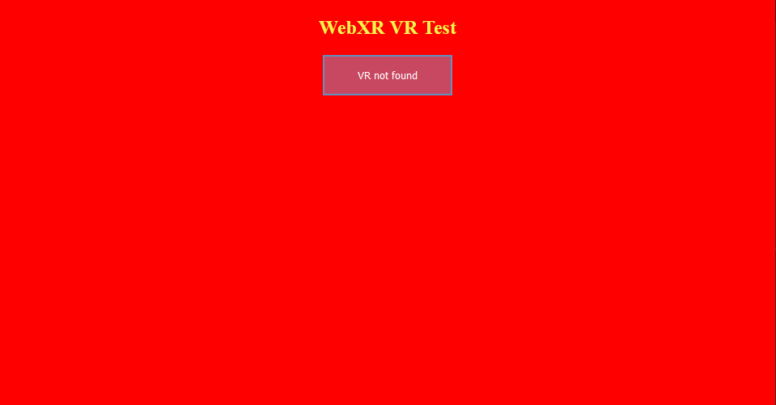

# Setup - WebGL 2 context initialization

## We're not gonna be jumping into WebXR just yet, first we have to figure out, how will we actually draw our scenes? 

Well, for that we will use WebGL 2. WebGL2 is a web API that links to OpenGLES3. The most important things about it is that it's modern, simple and widely supported. Plus, it can be used alongside old WebGL code. :D

Now, if you know what WebGL2 is, let's get to setting it up.

First of all, let's setup a WebGL Canvas. A canvas is an html5 object, that acts as a container for graphics.
We will create it using our beloved javascript:
```js
// We'll keep it as a global object
let canvas = null;

function initWebGL2() {
	canvas = document.createElement("canvas"); // creates a new canvas element ( <canvas></canvas> )
	document.body.appendChild(canvas); // appends/adds the canvas element to the document's body
}

initWebGL2(); // we call our init function, therefore initializing the application
```

Now, we have our canvas that we'll draw on, but how do we draw something on it? For that, we use `graphics contexts`.
There are lots of types of graphics contexts, for instance: 
- `2d` - used to draw simple graphics with our CPU, 
- `webgl` - used to draw advanced graphics with our GPU,
- `webgl2` - used for the same thing, but it's simpler and more optimized,
- `webgpu` - by far the best one of all these, but mostly unsupported, due to the fact of how new that technology is.

In these series we're gonna use `webgl2`, because it combines being simple, fast and widely supported.
Another reason to use it over anything else, is that WebXR requires you to use one of the webgl's.

So, how do you create a WebGL2 context? It's actually pretty simple:
```js
let canvas = null; // we'll keep it as a global object
let gl = null; // it will store our context, and all the functions and constants that are needed to use it

function initWebGL2() {
	canvas = document.createElement("canvas"); // creates a new canvas element ( <canvas></canvas> )
	gl = canvas.getContext("webgl2"); // creates a WebGL2 context, using the canvas
	document.body.appendChild(canvas); // appends/adds the canvas element to the document's body
}

initWebGL2(); // we call our init function, therefore initializing the application
```

See, we could (technically) end our initialization here, but there's a problem - not every device supports WebGL2.
Let's take a look at how we can test if the client's device does support it:
```js
let canvas = null; // we'll keep it as a global object
let gl = null; // it will store our context, and all the functions and constants that are needed to use it

function initWebGL2() {
	canvas = document.createElement("canvas"); // creates a new canvas element ( <canvas></canvas> )
	gl = canvas.getContext("webgl2"); // creates a WebGL2 context, using the canvas
	if(!gl) { // if the context DIDN'T create properly
		alert("This browser does not support WebGL 2."); // alert the user about it
		return; // go out of the function; stop this function
	}
	document.body.appendChild(canvas); // appends/adds the canvas element to the document's body
}

initWebGL2(); // we call our init function, therefore initializing the application
```

Now, that's great, isn't it? We can create our own html5 canvas and WebGL2 context!
Well, there are a couple more things we should do, before getting into thinking this way.

First of all; our canvas doesn't have a specified, proper size (we want it to be as big as the browser's window).
Let's fix it by adding a function that will make our canvas fit our entire screen:
```js
let canvas = null; // we'll keep it as a global object
let gl = null; // it will store our context, and all the functions and constants that are needed to use it

function onResize() { // this function resizes our canvas in a way, that makes it fit the entire screen perfectly!
	canvas.width = canvas.clientWidth * window.devicePixelRatio;
	canvas.height = canvas.clientHeight * window.devicePixelRatio;
}

window.onresize = onResize; // sets the window's resize function to be the exact function we use for resizing our canvas

function initWebGL2() {
	canvas = document.createElement("canvas"); // creates a new canvas element ( <canvas></canvas> )
	gl = canvas.getContext("webgl2"); // creates a WebGL2 context, using the canvas
	if(!gl) { // if the context DIDN'T create properly
		alert("This browser does not support WebGL 2."); // alert the user about it
		return; // go out of the function; stop this function
	}
	document.body.appendChild(canvas); // appends/adds the canvas element to the document's body
	onResize(); // resizes the canvas (it needs to be done, because otherwise it will not resize until you resize your window)
}

initWebGL2(); // we call our init function, therefore initializing the application
```

If you are able to somehow see this canvas on your website, you'll see that it in fact isn't really filling up our whole website,
there's a simple reason for this, that is: the lack of a style.
I mean the css style. We need it for our canvas, so that it will scale properly. 
Let's see how to code it:
```js
let canvas = null; // we'll keep it as a global object
let gl = null; // it will store our context, and all the functions and constants that are needed to use it

function onResize() { // this function resizes our canvas in a way, that makes it fit the entire screen perfectly!
	canvas.width = canvas.clientWidth * window.devicePixelRatio;
	canvas.height = canvas.clientHeight * window.devicePixelRatio;
}

window.onresize = onResize; // sets the window's resize function to be the exact function we use for resizing our canvas

function initWebGL2() {
	canvas = document.createElement("canvas"); // creates a new canvas element ( <canvas></canvas> )
	gl = canvas.getContext("webgl2"); // creates a WebGL2 context, using the canvas
	if(!gl) { // if the context DIDN'T create properly
		alert("This browser does not support WebGL 2."); // alert the user about it
		return; // go out of the function; stop this function
	}
	canvas.style = "position: absolute; width: 100%; height: 100%; left: 0; top: 0; right: 0; bottom: 0; margin: 0;"; // we add a simple style to our canvas
	document.body.appendChild(canvas); // appends/adds the canvas element to the document's body
	onResize(); // resizes the canvas (it needs to be done, because otherwise it will not resize until you resize your window)
}

initWebGL2(); // we call our init function, therefore initializing the application
```

What this style does is that it sets the width and height of our canvas to full window, and the offset between of left side of the window, right side of the window, top side of the window and the bottom side of the window with corresponding sides of our canvas to 0 pixels. It all combined should make our canvas full-window, but as you know we have specified a header that contains some text and a button. That header will be on the top of our canvas no matter what, even if we go through this hussle of setting it to be full-windowed.
So, how to fix it? It's very simple. We use the css `z-index` attribute for it. To set our canvas to be behind everything else on the site, we just set it's z-index to `-1`, like this:
```js
let canvas = null; // we'll keep it as a global object
let gl = null; // it will store our context, and all the functions and constants that are needed to use it

function onResize() { // this function resizes our canvas in a way, that makes it fit the entire screen perfectly!
	canvas.width = canvas.clientWidth * window.devicePixelRatio;
	canvas.height = canvas.clientHeight * window.devicePixelRatio;
}

window.onresize = onResize; // sets the window's resize function to be the exact function we use for resizing our canvas

function initWebGL2() {
	canvas = document.createElement("canvas"); // creates a new canvas element ( <canvas></canvas> )
	gl = canvas.getContext("webgl2"); // creates a WebGL2 context, using the canvas
	if(!gl) { // if the context DIDN'T create properly
		alert("This browser does not support WebGL 2."); // alert the user about it
		return; // go out of the function; stop this function
	}
	canvas.style = "position: absolute; width: 100%; height: 100%; left: 0; top: 0; right: 0; bottom: 0; margin: 0; z-index: -1;"; // we add a simple style to our canvas
	document.body.appendChild(canvas); // appends/adds the canvas element to the document's body
	onResize(); // resizes the canvas (it needs to be done, because otherwise it will not resize until you resize your window)
}

initWebGL2(); // we call our init function, therefore initializing the application
```

Now, we have created our canvas and got a context from it succesfully, how to test if it works?
We will have to clear our screen to see that. (Clearing it gives us an opportunity to test out WebGL2 too by the way.)
So how do we clear a screen?
In WebGL it's pretty easy, you first pick the color you want to clear the screen with, and then you clear it.
Like this:
```js
let canvas = null; // we'll keep it as a global object
let gl = null; // it will store our context, and all the functions and constants that are needed to use it

function onResize() { // this function resizes our canvas in a way, that makes it fit the entire screen perfectly!
	canvas.width = canvas.clientWidth * window.devicePixelRatio;
	canvas.height = canvas.clientHeight * window.devicePixelRatio;
}

window.onresize = onResize; // sets the window's resize function to be the exact function we use for resizing our canvas

function initWebGL2() {
	canvas = document.createElement("canvas"); // creates a new canvas element ( <canvas></canvas> )
	gl = canvas.getContext("webgl2"); // creates a WebGL2 context, using the canvas
	if(!gl) { // if the gl DIDN'T create properly
		alert("This browser does not support WebGL 2."); // alert the user about it
		return; // go out of the function; stop this function
	}
	canvas.style = "position: absolute; width: 100%; height: 100%; left: 0; top: 0; right: 0; bottom: 0; margin: 0; z-index: -1;"; // we add a simple style to our canvas
	document.body.appendChild(canvas); // appends/adds the canvas element to the document's body
	onResize(); // resizes the canvas (it needs to be done, because otherwise it will not resize until you resize your window)
	
	gl.clearColor(1.0, 0.0, 0.0, 1.0); // specifies the clearing color to be read (using RGBA)
	gl.clear(gl.COLOR_BUFFER_BIT); // clears the screen using a specified color
}

initWebGL2(); // we call our init function, therefore initializing the application
```

So now, you should see something like this:


You can check out the project's files [here](https://github.com/beProsto/webxr-tutorial/tree/master/projects/tutorial2)!

Next: <!-- [Setup - WebGL 2 context initialization](tutorial3) --> Coming in near future!
Previous: [Setup - the html document](tutorial1)