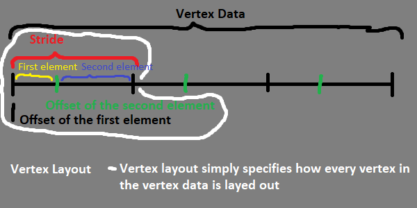

# WebGL 2 basics

## Now we know how to setup our WebGL2 application, we're getting close to finally doing WebXR, but we're not there just yet!

We've got to setup a game loop first, before getting into anything else;
The game loop is a sequence of actions, that happens in a game.
Essentially, our game has to be drawn to the screen every *frame*, we have to specify what happens in between these frames being drawn - maybe some movement happens, maybe something changes colors - that's up to you to specify.

We ended the last episode with a screen being coloured red once. The thing is, we want to color it up every frame. Let's see how we can do it. This is the code we were left with from the last episode:
```js
let canvas = null; // we'll keep it as a global object
let gl = null; // it will store our context, and all the functions and constants that are needed to use it

function onResize() { // this function resizes our canvas in a way, that makes it fit the entire screen perfectly!
	canvas.width = canvas.clientWidth * window.devicePixelRatio;
	canvas.height = canvas.clientHeight * window.devicePixelRatio;
}

window.onresize = onResize; // sets the window's resize function to be the exact function we use for resizing our canvas

function initWebGL2() {
	canvas = document.createElement("canvas"); // creates a new canvas element ( <canvas></canvas> )
	gl = canvas.getContext("webgl2"); // creates a WebGL2 context, using the canvas
	if(!gl) { // if the gl DIDN'T create properly
		alert("This browser does not support WebGL 2."); // alert the user about it
		return; // go out of the function; stop this function
	}
	canvas.style = "position: absolute; width: 100%; height: 100%; left: 0; top: 0; right: 0; bottom: 0; margin: 0; z-index: -1;"; // we add a simple style to our canvas
	document.body.appendChild(canvas); // appends/adds the canvas element to the document's body
	onResize(); // resizes the canvas (it needs to be done, because otherwise it will not resize until you resize your window)
	
	gl.clearColor(1.0, 0.0, 0.0, 1.0); // specifies the clearing color to be read (using RGBA)
	gl.clear(gl.COLOR_BUFFER_BIT); // clears the screen using a specified color
}

initWebGL2(); // we call our init function, therefore initializing the application
```

To add a game loop functionality, we simply have to create a function that specifies what will happen every frame, and tell our browser that we actually want it to be called every frame. It would be done like this:
```js
function onFrame() { // this function specifies what will happen every frame
	// the only thing we want to happen for now, is for our screen to be cleared with a nice green color
	gl.clearColor(0.3, 1.0, 0.4, 1.0); // specifies the clearing color to be read (using RGBA)
	gl.clear(gl.COLOR_BUFFER_BIT); // clears the screen using a specified color

	// we also have to tell our browser that we want this function to be called again in the next frame
	window.requestAnimationFrame(onFrame); // we specify what function do we want to be called for the next frame
}
```

That's fantastic - but if you check on our website now, it seems as if it didn't really update. It still shows the red color that we specified in our `initWebGL2` function, and doesn't update to the nice green that we specified in `onFrame`. It's because we have to tell our browser, that we want our next frame to be drawn using `onFrame`, not only in `onFrame` itself, but also in `initWebGL2`. Here's how:
```js
function initWebGL2() {
	canvas = document.createElement("canvas"); // creates a new canvas element ( <canvas></canvas> )
	gl = canvas.getContext("webgl2"); // creates a WebGL2 context, using the canvas
	if(!gl) { // if the gl DIDN'T create properly
		alert("This browser does not support WebGL 2."); // alert the user about it
		return; // go out of the function; stop this function
	}
	canvas.style = "position: absolute; width: 100%; height: 100%; left: 0; top: 0; right: 0; bottom: 0; margin: 0; z-index: -1;"; // we add a simple style to our canvas
	document.body.appendChild(canvas); // appends/adds the canvas element to the document's body
	onResize(); // resizes the canvas (it needs to be done, because otherwise it will not resize until you resize your window)
	
	gl.clearColor(1.0, 0.0, 0.0, 1.0); // specifies the clearing color to be read (using RGBA)
	gl.clear(gl.COLOR_BUFFER_BIT); // clears the screen using a specified color

	// here we have to tell our browser what function we will call during the next frame
	window.requestAnimationFrame(onFrame);
}
```

And that's all! Now we have succesfully setted up a game loop. We have a function called on the start of the application - `initWebGL2`, and a function called every frame - `onFrame`. Our code should look like this:
```js
let canvas = null; // we'll keep it as a global object
let gl = null; // it will store our context, and all the functions and constants that are needed to use it

function onResize() { // this function resizes our canvas in a way, that makes it fit the entire screen perfectly!
	canvas.width = canvas.clientWidth * window.devicePixelRatio;
	canvas.height = canvas.clientHeight * window.devicePixelRatio;
}

window.onresize = onResize; // sets the window's resize function to be the exact function we use for resizing our canvas

function initWebGL2() {
	canvas = document.createElement("canvas"); // creates a new canvas element ( <canvas></canvas> )
	gl = canvas.getContext("webgl2"); // creates a WebGL2 context, using the canvas
	if(!gl) { // if the gl DIDN'T create properly
		alert("This browser does not support WebGL 2."); // alert the user about it
		return; // go out of the function; stop this function
	}
	canvas.style = "position: absolute; width: 100%; height: 100%; left: 0; top: 0; right: 0; bottom: 0; margin: 0; z-index: -1;"; // we add a simple style to our canvas
	document.body.appendChild(canvas); // appends/adds the canvas element to the document's body
	onResize(); // resizes the canvas (it needs to be done, because otherwise it will not resize until you resize your window)
	
	gl.clearColor(1.0, 0.0, 0.0, 1.0); // specifies the clearing color to be read (using RGBA)
	gl.clear(gl.COLOR_BUFFER_BIT); // clears the screen using a specified color
	
	// we declare this function inside of the init function to make passing variables between them easier
	// yes js allows that
	// yes it looks horrible
	function onFrame() { // this function specifies what will happen every frame
		// the only thing we want to happen for now, is for our screen to be cleared with a nice green color
		gl.clearColor(0.3, 1.0, 0.4, 1.0); // specifies the clearing color to be read (using RGBA)
		gl.clear(gl.COLOR_BUFFER_BIT); // clears the screen using a specified color

		// we also have to tell our browser that we want this function to be called again in the next frame
		window.requestAnimationFrame(onFrame); // we specify what function do we want to be called for the next frame
	}	
	// here we have to tell our browser what function we will call during the next frame
	window.requestAnimationFrame(onFrame);
}

initWebGL2(); // we call our init function, therefore initializing the application
```

And our website should look something like this:


I will have to say that it doesn't matter where you have `onFrame` specified in your code. JavaScript will simply look it up and call it no matter where it is. I put it *inside* of `initWebGL2` function, which might help us with passing variables between them. For instance; if we want to load a model in the init function, and then render it in `onFrame`, with this approach we won't have to create global variables. 

The best part about it is that we will not have to modify it as much to actually get it to work in WebXR ecosystem. :D

What we have to do now is to learn a little bit of how modern OpenGL / GLES / WebGL2 works. Maybe you already know WebGL, but if you don't, [here's a tutorial series made by Indigo Code](https://www.youtube.com/watch?v=kB0ZVUrI4Aw&list=PLjcVFFANLS5zH_PeKC6I8p0Pt1hzph_rt).

To make a quick summary:
1. In WebGL, we draw using *triangles*.
2. We specify our triangles using arrays of points.
3. Our screen isn't represented using pixels, but the normalized coordinate system instead. 
4. We specify our shapes using triangles, these triangles are made up of points. Let's see how to define a simple 2d point in normalized coordinate system. <br/>Let's say our point is on `x: -0.5`, `y: 0.5`: 
5. Now let's specify a simple triangle, using three 2d points: <br/>`x: -0.5`, `y: -0.5` <br/>`x: 0.0`, `y: 0.5` <br/>`x: 0.5`, `y: -0.5`: 
6. If we connect these points and fill the space they take up with a nice color, like blue, we should get this: 
7. If you want more advanced shapes, you just make them out of triangles, it's as simple as it really gets.
8. Now I should say that OpenGL, or WebGL in this instance, isn't really 3d at it's base. You have to implement 3d yourself, using maths. In most cases, matrix maths. (Because GPUs are designed to be good and fast at multiplying matricies.)
9. In WebGL, we create objects, after we create them we can destroy them, bind or unbind them. After we bind them, we can operate on them using functions. This is how it would look like if we wanted to create, a texture for instance:
	- Create a texture
	- Bind the texture
	- Supply data to the texture
	- Unbind the texture
	- ...
	- **When drawing something with that texture**
	- Bind the texture
	- Draw
	- Unbind the texture
	- ...
	- **When we're done with our texture**
	- Destroy the texture
10. So now, that you know how WebGL operates, let's see how we can draw something using it.
11. Get to know some simple object types you can create in WebGL2:
	- Buffers - Are used to store data.
		- Vertex Buffers - Store data about vertices (points), like vertex positions, vertex colors, vertex texture coordinates, vertex normals, anything at all.
	- Vertex Arrays - Store data about vertex layout.
		- They tell us how a vertex is being partitioned - how they are layed out. They can link to one or more vertex buffers, telling us which store which vertex data, or how do they do that. For instance, we can make a vertex buffer for vertex positions, and a vertex buffer for vertex colors and then link them using a vertex array. We will not use it this way however - to make life simpler for ourselves. Instead we're just gonna store our vertices as globs of data, in an array, which means that instead of doing seperate arrays (vertex buffers) for vertex positions and vertex colors, we're just gonna have them all in one. Believe me that it makes more than one thing easier.
	- Shaders - They take in shader's code in form of a string, and the shader type in form of an enum.
		- There's lots of shader types, we're gonna use just two:
			- Vertex Shaders - They take in vertex data and do calculations on them, to return a simple 2d point in normalized coordinate space
			- Fragment Shaders - (Pixel Shaders) They specify how every pixel that our shape takes up on the screen will look like (what color it will be).
	- Programs - They combine shaders and let them work toghever.
		- They make it possible for us to actually draw things, because they contain shaders telling our GPU how to position and color stuff.
	- Textures - Are used to store data.
		- Just like Buffers, Textures are used to store data, except textures are designed to store image data. They can be passed into Fragment Shaders, and used by these to color pixels of our shapes in corresponding colors of our texture.
	- Frame Buffers - These are the things that you actually draw on.
		- You have a main frame buffer, which is the one defaultly bound, and the one that simply represents your screen.
		- You can bind additional frame buffers, which can draw to their textures.
		- To get back to drawing to the main frame buffer, you just unbind the currently bound one.
12. As you might see, we barely scratched the surface of what WebGL lets us do, and what are it's possibilities, but it's enough to get you going on this course - if you want to learn more, you're or on your own, or with [learnopengl tutorials](https://learnopengl.com/) (keep in mind that they are not in javascript, c++ instead, but they still are useful in providing information on OpenGL itself), or you might as well check out [MDN articles about WebGL/WebGL2](https://developer.mozilla.org/en-US/docs/Web/API/WebGL_API).
13. Let's get back to coding, shall we?

So, now that you know basics of WebGL2, we should start coding a simple application. What I'd aim to achieve here would be a simple triangle, coloured blue.
Let's create a couple variables that will store our WebGL2 objects. Let's create a Vertex Buffer, Vertex Array, Vertex Shader, Fragment Shader and a Program.
```js
let vertexBuffer = null;
let vertexArray = null;
let vertexShader = null;
let fragmentShader = null;
let program = null;
```

Now let's set them all up, first, a simple vertex buffer. We will first define the vertex data:
```js
const vertexData = [ // a simple triangle in the middle of the screen
	-0.5, -0.5, // every line simply defines a new 2d point
	0.0, 0.5,
	0.5, -0.5
];
```

Now let's create, bind and supply with data our vertex buffer:
```js
vertexBuffer = gl.createBuffer(); // creates a new buffer
gl.bindBuffer(gl.ARRAY_BUFFER, vertexBuffer); // binds the vertex buffer as a vertex buffer
// WebGL2 defines Vertex Buffer as Array Buffer, but it's literally the same thing
gl.bufferData(gl.ARRAY_BUFFER, new Float32Array(vertexData), gl.STATIC_DRAW); // we tell opengl that we want to supply the currently bound vertex buffer (array buffer) with data, that's represented as a 32 bit float array, that will not be changed or modified oftenly (STATIC_DRAW says that)
gl.bindBuffer(gl.ARRAY_BUFFER, null); // we unbind the currently bound vertex buffer (array buffer)
```

Let's create a simple Vertex Array:
```js
vertexArray = gl.createVertexArray(); // creates a new vertex array
gl.bindVertexArray(vertexArray); // binds the new vertex array
// Now we need to supply our vertex array with vertex layout data. For now it's simple, because it's just one 2d point per vertex, but once it gets more advanced you'll see why you need to understand what's going on here
gl.bindBuffer(gl.ARRAY_BUFFER, vertexBuffer); // we bind our vertex buffer, because it stores or will store the vertex data (in this example it already stores some, but it doesn't really matter, as long as you bound it in this step)
gl.vertexAttribPointer(
	0, // the location of our vertex layout element, in this case it will be zero, as it's the first one
	2, // how much data this vertex layout element contains, in this case there are 2 floats per point, so that's what we say here
	gl.FLOAT, // what type the data is, as i said, these are floats
	false, // tells WebGL if it should normalize this data (modify it accordingly to the types limitations, to make it a float), when working with floats we don't have to do this, so we say false
	2 * 4, // this specifies a stride, or a size in bytes of one vertex. In our case the full vertex only takes up two floats, so we say two times size (in bytes) of float, which is four.
	0 // this is an offset, it tells us how far away (in bytes) this vertex layout element is from the start of the vertex
);
gl.enableVertexAttribArray(0); // we tell WebGL that we have the first vertex layout location allocated in this vertex array
```

This is how you can understand vertex strides and offsets in a simple form of an image:
