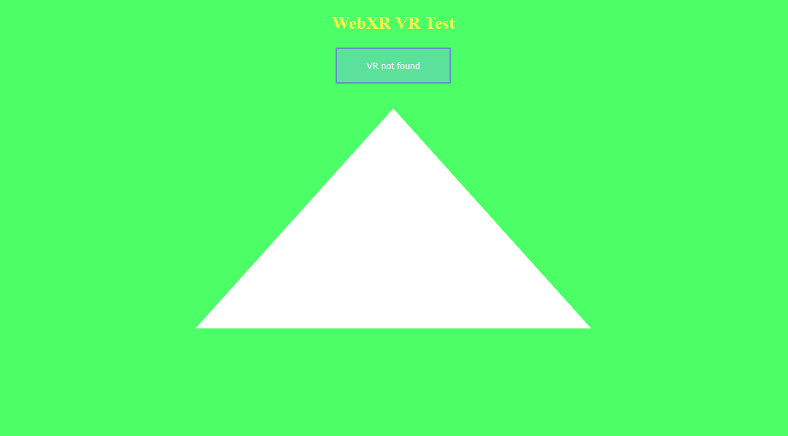

# A simple WebGL 2 abstraction

## Now we know how to setup our WebGL2 application, we're getting close to finally doing WebXR, but we're not there just yet!

We've got to setup a game loop first, before getting into anything else;
The game loop is a sequence of actions, that happens in a game.
Essentially, our game has to be drawn to the screen every *frame*, we have to specify what happens in between these frames being drawn - maybe some movement happens, maybe something changes colors - that's up to you to specify.

We ended the last episode with a screen being coloured red once. The thing is, we want to color it up every frame. Let's see how we can do it. This is the code we were left with from the last episode:
```js
let canvas = null; // we'll keep it as a global object
let gl = null; // it will store our context, and all the functions and constants that are needed to use it

function onResize() { // this function resizes our canvas in a way, that makes it fit the entire screen perfectly!
	canvas.width = canvas.clientWidth * window.devicePixelRatio;
	canvas.height = canvas.clientHeight * window.devicePixelRatio;
}

window.onresize = onResize; // sets the window's resize function to be the exact function we use for resizing our canvas

function initWebGL2() {
	canvas = document.createElement("canvas"); // creates a new canvas element ( <canvas></canvas> )
	gl = canvas.getContext("webgl2"); // creates a WebGL2 context, using the canvas
	if(!gl) { // if the gl DIDN'T create properly
		alert("This browser does not support WebGL 2."); // alert the user about it
		return; // go out of the function; stop this function
	}
	canvas.style = "position: absolute; width: 100%; height: 100%; left: 0; top: 0; right: 0; bottom: 0; margin: 0; z-index: -1;"; // we add a simple style to our canvas
	document.body.appendChild(canvas); // appends/adds the canvas element to the document's body
	onResize(); // resizes the canvas (it needs to be done, because otherwise it will not resize until you resize your window)
	
	gl.clearColor(1.0, 0.0, 0.0, 1.0); // specifies the clearing color to be read (using RGBA)
	gl.clear(gl.COLOR_BUFFER_BIT); // clears the screen using a specified color
}

initWebGL2(); // we call our init function, therefore initializing the application
```

To add a game loop functionality, we simply have to create a function that specifies what will happen every frame, and tell our browser that we actually want it to be called every frame. It would be done like this:
```js
function onFrame() { // this function specifies what will happen every frame
	// the only thing we want to happen for now, is for our screen to be cleared with a nice green color
	gl.clearColor(0.3, 1.0, 0.4, 1.0); // specifies the clearing color to be read (using RGBA)
	gl.clear(gl.COLOR_BUFFER_BIT); // clears the screen using a specified color

	// we also have to tell our browser that we want this function to be called again in the next frame
	window.requestAnimationFrame(onFrame); // we specify what function do we want to be called for the next frame
}
```

That's fantastic - but if you check on our website now, it seems as if it didn't really update. It still shows the red color that we specified in our `initWebGL2` function, and doesn't update to the nice green that we specified in `onFrame`. It's because we have to tell our browser, that we want our next frame to be drawn using `onFrame`, not only in `onFrame` itself, but also in `initWebGL2`. Here's how:
```js
function initWebGL2() {
	canvas = document.createElement("canvas"); // creates a new canvas element ( <canvas></canvas> )
	gl = canvas.getContext("webgl2"); // creates a WebGL2 context, using the canvas
	if(!gl) { // if the gl DIDN'T create properly
		alert("This browser does not support WebGL 2."); // alert the user about it
		return; // go out of the function; stop this function
	}
	canvas.style = "position: absolute; width: 100%; height: 100%; left: 0; top: 0; right: 0; bottom: 0; margin: 0; z-index: -1;"; // we add a simple style to our canvas
	document.body.appendChild(canvas); // appends/adds the canvas element to the document's body
	onResize(); // resizes the canvas (it needs to be done, because otherwise it will not resize until you resize your window)
	
	gl.clearColor(1.0, 0.0, 0.0, 1.0); // specifies the clearing color to be read (using RGBA)
	gl.clear(gl.COLOR_BUFFER_BIT); // clears the screen using a specified color

	// here we have to tell our browser what function we will call during the next frame
	window.requestAnimationFrame(onFrame);
}
```

And that's all! Now we have succesfully setted up a game loop. We have a function called on the start of the application - `initWebGL2`, and a function called every frame - `onFrame`. Our code should look like this:
```js
let canvas = null; // we'll keep it as a global object
let gl = null; // it will store our context, and all the functions and constants that are needed to use it

function onResize() { // this function resizes our canvas in a way, that makes it fit the entire screen perfectly!
	canvas.width = canvas.clientWidth * window.devicePixelRatio;
	canvas.height = canvas.clientHeight * window.devicePixelRatio;
}

window.onresize = onResize; // sets the window's resize function to be the exact function we use for resizing our canvas

function initWebGL2() {
	canvas = document.createElement("canvas"); // creates a new canvas element ( <canvas></canvas> )
	gl = canvas.getContext("webgl2"); // creates a WebGL2 context, using the canvas
	if(!gl) { // if the gl DIDN'T create properly
		alert("This browser does not support WebGL 2."); // alert the user about it
		return; // go out of the function; stop this function
	}
	canvas.style = "position: absolute; width: 100%; height: 100%; left: 0; top: 0; right: 0; bottom: 0; margin: 0; z-index: -1;"; // we add a simple style to our canvas
	document.body.appendChild(canvas); // appends/adds the canvas element to the document's body
	onResize(); // resizes the canvas (it needs to be done, because otherwise it will not resize until you resize your window)
	
	gl.clearColor(1.0, 0.0, 0.0, 1.0); // specifies the clearing color to be read (using RGBA)
	gl.clear(gl.COLOR_BUFFER_BIT); // clears the screen using a specified color
	
	// we declare this function inside of the init function to make passing variables between them easier
	// yes js allows that
	// yes it looks horrible
	function onFrame() { // this function specifies what will happen every frame
		// the only thing we want to happen for now, is for our screen to be cleared with a nice green color
		gl.clearColor(0.3, 1.0, 0.4, 1.0); // specifies the clearing color to be read (using RGBA)
		gl.clear(gl.COLOR_BUFFER_BIT); // clears the screen using a specified color

		// we also have to tell our browser that we want this function to be called again in the next frame
		window.requestAnimationFrame(onFrame); // we specify what function do we want to be called for the next frame
	}	
	// here we have to tell our browser what function we will call during the next frame
	window.requestAnimationFrame(onFrame);
}

initWebGL2(); // we call our init function, therefore initializing the application
```

And our website should look something like this:


I will have to say that it doesn't matter where you have `onFrame` specified in your code. JavaScript will simply look it up and call it no matter where it is. I put it *inside* of `initWebGL2` function, which might help us with passing variables between them. For instance; if we want to load a model in the init function, and then render it in `onFrame`, with this approach we won't have to create global variables. 

The best part about it is that we will not have to modify it as much to actually get it to work in WebXR ecosystem. :D

What we have to do now is to learn a little bit about modern OpenGL / GLES / WebGL2, or just follow along this tutorial without knowing anything about them, and theach yourself about them later instead. Both are accurate approaches, in this article I'm writing a simple abstraction for WebGL2, so that even if you don't know WebGL2, you still can enjoy, and learn from these tutorials. Maybe you already know WebGL, but if you don't, and want to learn it, [here's a very good video tutorial series made by Indigo Code](https://www.youtube.com/watch?v=kB0ZVUrI4Aw&list=PLjcVFFANLS5zH_PeKC6I8p0Pt1hzph_rt).

I don't want to spend all the time in this tutorial talking about what WebGL2 lets us do, it would quickly turn into a very poor WebGL2 tutorial (believe me, i tried) - if you want to learn more, you're or on your own, or with [learnopengl tutorials](https://learnopengl.com/) (keep in mind that they are not in javascript, c++ instead, but they still are useful in providing information on OpenGL itself), or you might as well check out [MDN articles about WebGL/WebGL2](https://developer.mozilla.org/en-US/docs/Web/API/WebGL_API).

Now, with that out of the way, let's write a simple abstraction.
First, let's create a file named `ezgl.js` (this will be where we'll store this whole abstraction).
We'll fill it up with basic-ass WebGL2 abstraction for Vertex Buffers, Shaders, and textures:
```js
let gl = null; // a global gl variable, we will assign our WebGL2 context to it
const ezgl = { // inside of this object there will be all the basic abstraction
	VertexBuffer: class { // both vertex buffer and vertex array, whereas the vertex array is here only to store the vertex layout
		constructor() {
			this.va = gl.createVertexArray();
			gl.bindVertexArray(this.va);

			this.vb = gl.createBuffer();
			gl.bindBuffer(gl.ARRAY_BUFFER, this.vb);

			this.stride = 0;
			this.length = 0;
			this.vertices = 0;
			
			gl.bindBuffer(gl.ARRAY_BUFFER, null);
			gl.bindVertexArray(null);
		}
		free() { // free functions - they just delete all the WebGL2 objects created with the object
			gl.deleteBuffer(this.vb);
			gl.deleteVertexArray(this.va);
		}

		vertexLayout(layout = [3, 2, 3]) { // this function supplies the vertex layout - it says how many elements there are per vertex, and how much floats they take up. we will mostly use the [3, 2, 3] combination, because it's the one used by OBJ models
			for(let i = 0; i < layout.length; i++) {
				this.stride += layout[i] * 4;
			}
			
			gl.bindVertexArray(this.va);
			gl.bindBuffer(gl.ARRAY_BUFFER, this.vb);

			let istride = 0;
			for(let i = 0; i < layout.length; i++) {
				gl.vertexAttribPointer(i, layout[i], gl.FLOAT, false, this.stride, istride);
				gl.enableVertexAttribArray(i);

				istride += layout[i] * 4;
			}
			
			gl.bindBuffer(gl.ARRAY_BUFFER, null);
			gl.bindVertexArray(null);

			this.stride = this.stride / 4;
			this.vertices = this.length / this.stride;
		}
		vertexData(data) { // simply takes in a Float32Array and supplies it to the buffer
			this.length = data.length;
			gl.bindVertexArray(this.va);
			gl.bindBuffer(gl.ARRAY_BUFFER, this.vb);
			gl.bufferData(gl.ARRAY_BUFFER, new Float32Array(data), gl.STATIC_DRAW);
			gl.bindBuffer(gl.ARRAY_BUFFER, null);
			gl.bindVertexArray(null);
			this.vertices = this.length / this.stride;
		}
		draw() { // draws our mesh
			gl.bindVertexArray(this.va);
			gl.bindBuffer(gl.ARRAY_BUFFER, this.vb);

			gl.drawArrays(gl.TRIANGLES, 0, this.vertices);

			gl.bindBuffer(gl.ARRAY_BUFFER, null);
			gl.bindVertexArray(null);
		}
		
	},
	SubShader: class { // known as shader in WebGL2, simply contains shader code and type
		constructor(type, str) {
			this.shader = gl.createShader(type);
			gl.shaderSource(this.shader, str);
			gl.compileShader(this.shader);
		}
		free() {
			gl.deleteShader(this.shader);
		}
	},
	Shader: class { // known as a program in WebGL2, just joins and links shaders
		constructor() {
			this.program = gl.createProgram();
		}
		free() {
			gl.deleteProgram(this.program);
		}

		join(subshader) {
			gl.attachShader(this.program, subshader.shader);
			return this;
		}
		link() {
			gl.linkProgram(this.program);
			gl.useProgram(this.program);
			gl.useProgram(null);
			return this;
		}

		bind() {
			gl.useProgram(this.program);
			return this;
		}
		unbind() {
			gl.useProgram(null);
			return this;
		}

		// these are used for setting uniforms in shaders
		set1i(name, val) { // mostly for texture IDs
			gl.uniform1i(gl.getUniformLocation(this.program, name), val);
			return this;
		}
		set1f(name, val) { // maybe will find some kind of a use
			gl.uniform1f(gl.getUniformLocation(this.program, name), val);
			return this;
		}
		set2f(name, x, y) { // maybe will find some kind of a use 
			gl.uniform2f(gl.getUniformLocation(this.program, name), x, y);
			return this;
		}
		set3f(name, x, y, z) { // maybe will find some kind of a use 
			gl.uniform3f(gl.getUniformLocation(this.program, name), x, y, z);
			return this;
		}
		set4f(name, x, y, z, w) { // maybe will find some kind of a use (most likely colors)
			gl.uniform4f(gl.getUniformLocation(this.program, name), x, y, z, w);
			return this;
		}
		set4x4f(name, mat) { // for matrices (projection, view, model)
			gl.uniformMatrix4fv(gl.getUniformLocation(this.program, name), false, mat);
			return this;
		}
	},
	Texture: class { // Just a simple texture, and it can be loaded from a file
		constructor() {
			this.texture = gl.createTexture();
			gl.bindTexture(gl.TEXTURE_2D, this.texture);
			gl.bindTexture(gl.TEXTURE_2D, null);
		}
		free() {
			gl.deleteTexture(this.texture);
		}

		fromFile(url, options = {wrap: gl.REPEAT, filter: gl.NEAREST}) {
			gl.bindTexture(gl.TEXTURE_2D, this.texture);
			gl.texImage2D(gl.TEXTURE_2D, 0, gl.RGBA, 1, 1, 0, gl.RGBA, gl.UNSIGNED_BYTE, new Uint8Array([255, 0, 255, 255]));
			gl.texParameteri(gl.TEXTURE_2D, gl.TEXTURE_WRAP_S, options.wrap);
			gl.texParameteri(gl.TEXTURE_2D, gl.TEXTURE_WRAP_T, options.wrap);
			gl.texParameteri(gl.TEXTURE_2D, gl.TEXTURE_MIN_FILTER, options.filter);
			gl.texParameteri(gl.TEXTURE_2D, gl.TEXTURE_MAG_FILTER, options.filter);
			let that = this;
			const img = new Image();
			img.onload = function() {
				gl.bindTexture(gl.TEXTURE_2D, that.texture);
				gl.texImage2D(gl.TEXTURE_2D, 0, gl.RGBA, gl.RGBA, gl.UNSIGNED_BYTE, img);
			};
			img.src = url;
		}
		fromData(data, options = {wrap: gl.REPEAT, filter: gl.NEAREST}) {
			gl.bindTexture(gl.TEXTURE_2D, this.texture);
			gl.texImage2D(gl.TEXTURE_2D, 0, gl.RGBA, 1, 1, 0, gl.RGBA, gl.UNSIGNED_BYTE, new Uint8Array(data));
			gl.texParameteri(gl.TEXTURE_2D, gl.TEXTURE_WRAP_S, options.wrap);
			gl.texParameteri(gl.TEXTURE_2D, gl.TEXTURE_WRAP_T, options.wrap);
			gl.texParameteri(gl.TEXTURE_2D, gl.TEXTURE_MIN_FILTER, options.filter);
			gl.texParameteri(gl.TEXTURE_2D, gl.TEXTURE_MAG_FILTER, options.filter);
		}

		bind(slot = 0) {
			gl.activeTexture(gl.TEXTURE0 + slot);
			gl.bindTexture(gl.TEXTURE_2D, this.texture);
		}
	}
};
```

If you know WebGL2 - that code might've even made sense to you, if you don't - just copy and paste it, soon you will not have to look at WebGL2 code whatsoever.
You should of course also load that script into your website - go to `index.html` and type:
```html
<script type="text/javascript" src="ezgl.js"></script>
```

Make sure to do it before `<script type="module" src="index.js"></script>`, so you'll end up with something like this:
```html
<script type="text/javascript" src="ezgl.js"></script>
<script type="module" src="index.js"></script>
```

Now, let's get to model loading. We want to load up simple 3D models from `*.obj` files. It's a pretty easy format to load from, just create a file named `ezobj.js` and code for it looks like this:
```js
const ezobj = {
	insertXYZ: function(array, x, y, z) {
		array.push(x);
		array.push(y);
		array.push(z);
	},
	insertUV: function(array, u, v) {
		array.push(u);
		array.push(v);
	},
	getX: function(array, index) {
		return array[index * 3];
	},
	getY: function(array, index) {
		return array[index * 3 + 1];
	},
	getZ: function(array, index) {
		return array[index * 3 + 2];
	},
	getU: function(array, index) {
		return array[index * 2];
	},
	getV: function(array, index) {
		return array[index * 2 + 1];
	},
	getIndex: function(index) {
		return parseInt(index) - 1;
	},
	insertVertex: function(dest, positions, texcoords, normals, vertstr) {
		const indicesStr = vertstr.split("/");
		const indexPos = ezobj.getIndex(indicesStr[0]);
		const indexTex = ezobj.getIndex(indicesStr[1]);
		const indexNor = ezobj.getIndex(indicesStr[2]);

		dest.push(ezobj.getX(positions, indexPos));
		dest.push(ezobj.getY(positions, indexPos));
		dest.push(ezobj.getZ(positions, indexPos));

		dest.push(ezobj.getU(texcoords, indexTex));
		dest.push(ezobj.getV(texcoords, indexTex));
		
		dest.push(ezobj.getX(normals, indexNor));
		dest.push(ezobj.getY(normals, indexNor));
		dest.push(ezobj.getZ(normals, indexNor));
	},
	load: function(obj) {
		let dest = [];
		let positions = [];
		let texcoords = [];
		let normals = [];
		
		const lines = obj.split("\n");
		for(let i = 0; i < lines.length; i++) {
			const line = lines[i].split(" ");
			
			if(line[0] == "vt") {
				ezobj.insertUV(texcoords, parseFloat(line[1]), parseFloat(line[2]));
			}
			else if(line[0] == "vn") {
				ezobj.insertXYZ(normals, parseFloat(line[1]), parseFloat(line[2]), parseFloat(line[3]));
			}
			else if(line[0] == "v") {
				ezobj.insertXYZ(positions, parseFloat(line[1]), parseFloat(line[2]), parseFloat(line[3]));
			}
			else if(line[0] == "f") {
				ezobj.insertVertex(dest, positions, texcoords, normals, line[1]);
				ezobj.insertVertex(dest, positions, texcoords, normals, line[2]);
				ezobj.insertVertex(dest, positions, texcoords, normals, line[3]);
			}
		}
		return dest;
	},
};
```

The only function we'll need to care about will be the `load` function. It takes in our model as a string of already loaded text.
Which means that later on, we'll have to load the file as text ourselves, and then pass that text into this function to get out a mesh.

Also, remember to import this script in you html code, just like the other ones:
```html
<script type="text/javascript" src="ezgl.js"></script>
<script type="text/javascript" src="ezobj.js"></script>
<script type="module" src="index.js"></script>
```

And the last one we'll create will be named `ezgfx.js`, and yes - `ez` is my prefix for everything, i just like it. :D Again, import it:
```html
<script type="text/javascript" src="ezgl.js"></script>
<script type="text/javascript" src="ezobj.js"></script>
<script type="text/javascript" src="ezgfx.js"></script>
<script type="module" src="index.js"></script>
```

And now, let's write a simple abstraction for almost everything we need:
```js
let ezgfxGlobals = {}; // not for use by the user - it's just some global constants that are needed by our shaders 
const ezgfx = {
	Mesh: class {
		constructor() {
			this.vertexbuffer = new ezgl.VertexBuffer();
			this.vertexbuffer.vertexLayout([3, 2, 3]);
		}
		free() {
			this.vertexbuffer.free();
		}

		loadFromData(data) {
			this.vertexbuffer.vertexData(data);
		}
		loadFromOBJ(url) {
			this.vertexbuffer.vertexData(ezgfxGlobals.triangle);
			fetch(url).then(response => {
				response.text().then(text => {
					const verticesLoaded = ezobj.load(text);
					this.vertexbuffer.vertexData(verticesLoaded);
				});
			});
		}
	},
	Texture: class {
		constructor() {
			this.texture = new ezgl.Texture();
		}
		free() {
			this.texture.free();
		}

		loadFromFile(url, options = {wrap: gl.REPEAT, filter: gl.NEAREST}) {
			this.texture.fromFile(url, options);
		}
		loadFromData(data, options = {wrap: gl.REPEAT, filter: gl.NEAREST}) {
			this.texture.fromData(data, options);
		}
	},
	Material: class {
		constructor(customShader = null) {
			this.shader = new ezgl.Shader();
			this.shader.join(ezgfxGlobals.vSS);
			if(!customShader) {
				this.shader.join(ezgfxGlobals.fSS);
				this.shader.link();
			}
			else {
				let fSS = new ezgl.SubShader(gl.FRAGMENT_SHADER, ezgfxGlobals.fSSC0 + customShader + ezgfxGlobals.fSSC1); 
				this.shader.join(fSS);
				this.shader.link();
				fSS.free();
			}

			this.shader.bind();
			this.textures = [];
			for(let i = 0; i < 16; i++) {
				this.shader.set1i("u_TexID[" + i + "]", i);
			}
			this.shader.unbind();
		}
		free() {
			this.shader.free();
		}

		setProjection(mat) {
			this.shader.bind();
			this.shader.set4x4f("u_Projection", mat);
			this.shader.unbind();
		}
		setView(mat) {
			this.shader.bind();
			this.shader.set4x4f("u_View", mat);
			this.shader.unbind();
		}
		setModel(mat) {
			this.shader.bind();
			this.shader.set4x4f("u_Model", mat);
			this.shader.unbind();
		}

		setTexture(texture, slot = 0) {
			this.textures[slot] = texture.texture;
		}
	},
	Renderer: class {
		constructor() {
			this.color = [0.0, 0.0, 0.0, 1.0];
			gl.clearColor(0.0, 0.0, 0.0, 1.0);
			
			this.masks = gl.COLOR_BUFFER_BIT;
			this.depthTest = false;

			ezgfxGlobals.fSSC0 = "#version 300 es\n\
			precision mediump float;\n\
			\n\
			out vec4 o_Color;\n\
			\n\
			in vec2 v_TexCoord;\n\
			\n\
			uniform sampler2D u_TexID[16];\n";
			ezgfxGlobals.fSSC1 = "\nvoid main() {\n\
				o_Color = shader();\n\
			}";
			ezgfxGlobals.vSS = new ezgl.SubShader(gl.VERTEX_SHADER, "#version 300 es\n\
			precision mediump float;\n\
			\n\
			layout(location = 0) in vec3 a_Position;\n\
			layout(location = 1) in vec2 a_TexCoord;\n\
			layout(location = 2) in vec3 a_Normal;\n\
			\n\
			uniform mat4 u_Projection;\n\
			uniform mat4 u_View;\n\
			uniform mat4 u_Model;\n\
			\n\
			out vec2 v_TexCoord;\n\
			\n\
			void main() {\n\
			gl_Position = u_Projection * u_View * u_Model * vec4(a_Position, 1.0);\n\
				v_TexCoord = a_TexCoord;\n\
				v_TexCoord.y = 1.0 - v_TexCoord.y;\n\
			}");
			ezgfxGlobals.fSS = new ezgl.SubShader(gl.FRAGMENT_SHADER, ezgfxGlobals.fSSC0 + "\nvec4 shader() { return vec4(1.0); }\n" + ezgfxGlobals.fSSC1),
				
			ezgfxGlobals.triangle = [
					-0.5, -0.5, 0.0,
						0.0, 0.0,
							0.0, 0.0, 1.0,
					0.0, 0.5, 0.0,
						0.5, 1.0,
							0.0, 0.0, 1.0,
					0.5, -0.5, 0.0,
						1.0, 0.0,
							0.0, 0.0, 1.0 
			];
		}
		depthTesting(enable) {
			if(enable && !this.depthTest) {
				this.masks = gl.COLOR_BUFFER_BIT | gl.DEPTH_BUFFER_BIT;
				gl.enable(gl.DEPTH_TEST);
			}
			else if(!enable && this.depthTest) {
				this.masks = gl.COLOR_BUFFER_BIT;
				gl.disable(gl.DEPTH_TEST);
			}
		}
		clear(color = [0.0, 0.0, 0.0, 1.0]) {
			if(color != this.color) {
				gl.clearColor(color[0], color[1], color[2], color[3]);
				this.color = color;
			}
			gl.clear(this.masks);
		}
		draw(mesh, material) {
			material.shader.bind();
			for(let i = 0; i < material.textures.size; i++) {
				material.textures[i].bind(i);
			}
			mesh.vertexbuffer.draw();
			material.shader.unbind();
		}
	}
};
```

With this type of abstraction we basically don't need to write almost any WebGL2 code.
All we have to do, is to create a new `ezgfx` Renderer, create a mesh and a material, and we're all set!
Actually, let's write a simple test for this:
```js
let canvas = null; // we'll keep it as a global object

function onResize() { // this function resizes our canvas in a way, that makes it fit the entire screen perfectly!
	canvas.width = canvas.clientWidth * window.devicePixelRatio;
	canvas.height = canvas.clientHeight * window.devicePixelRatio;
}

window.onresize = onResize; // sets the window's resize function to be the exact function we use for resizing our canvas

function initWebGL2() {
	canvas = document.createElement("canvas"); // creates a new canvas element ( <canvas></canvas> )
	gl = canvas.getContext("webgl2"); // creates a WebGL2 context, using the canvas
	if(!gl) { // if the gl DIDN'T create properly
		alert("This browser does not support WebGL 2."); // alert the user about it
		return; // go out of the function; stop this function
	}
	canvas.style = "position: absolute; width: 100%; height: 100%; left: 0; top: 0; right: 0; bottom: 0; margin: 0; z-index: -1;"; // we add a simple style to our canvas
	document.body.appendChild(canvas); // appends/adds the canvas element to the document's body
	onResize(); // resizes the canvas (it needs to be done, because otherwise it will not resize until you resize your window)
	
	const renderer = new ezgfx.Renderer(); // creates a new ezgfx Renderer
	renderer.clear([0.3, 1.0, 0.4, 1.0]); // clears the screen to be nice and green

	const mesh = new ezgfx.Mesh(); // we create a new mesh
	mesh.loadFromData(ezgfxGlobals.triangle); // we make our mesh to be a simple triangle

	const material = new ezgfx.Material(); // we create a material
	// We're setting all our matrices to identity (i'll talk about it in a minute)
	const identityMatrix = new Float32Array([
		1.0, 0.0, 0.0, 0.0,
		0.0, 1.0, 0.0, 0.0,
		0.0, 0.0, 1.0, 0.0,
		0.0, 0.0, 0.0, 1.0
	]);
	material.setProjection(identityMatrix);
	material.setView(identityMatrix);
	material.setModel(identityMatrix);

	// we declare this function inside of the init function to make passing variables between them easier
	function onFrame() { // this function specifies what will happen every frame
		gl.viewport(0, 0, canvas.width, canvas.height); // resizes the webgl2's virtual viewport to fit the entire screen
		renderer.clear([0.3, 1.0, 0.4, 1.0]); // clears the screen with the specified green color (RGBA)

		renderer.draw(mesh, material); // draws our triangle combined with the material of our choice

		// we also have to tell our browser that we want this function to be called again in the next frame
		window.requestAnimationFrame(onFrame);
	}	
	// here we have to tell our browser what function we will call during the next frame
	window.requestAnimationFrame(onFrame);
}

initWebGL2(); // we call our init function, therefore initializing the application
```

And now you should see a nice, big, white triangle in the middle of your screen:


You can check out the project's files [here](https://github.com/beProsto/webxr-tutorial/tree/master/projects/tutorial3)!

Next: Coming Soon!
Previous: [Setup - WebGL 2 context initialization](tutorial2)

<div GITHUB_API_ID="3"></div>

