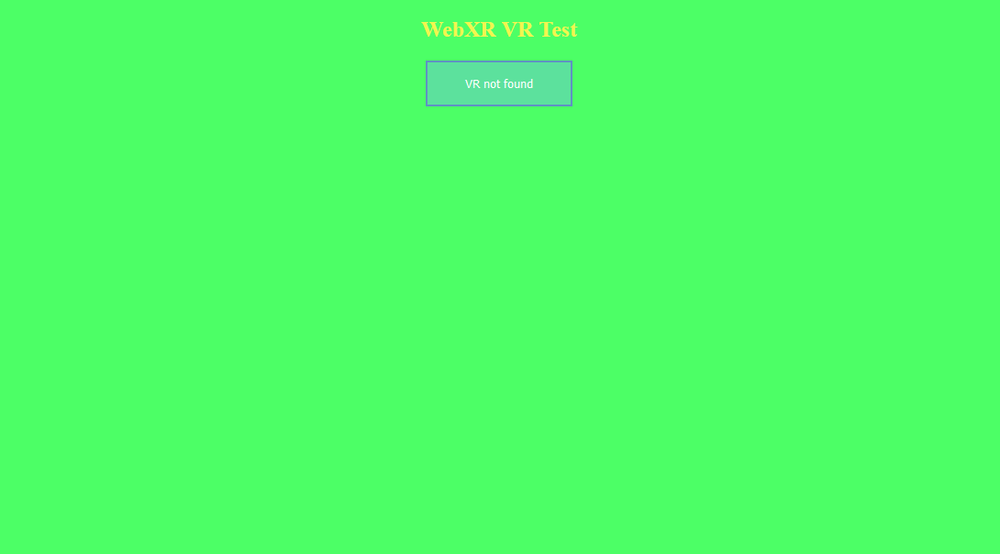

# WebGL 2 basics

## Now we know how to setup our WebGL2 application, we're getting close to finally doing WebXR, but we're not there just yet!

We've got to setup a game loop first, before getting into anything else;
The game loop is a sequence of actions, that happens in a game.
Essentially, our game has to be drawn to the screen every *frame*, we have to specify what happens in between these frames being drawn - maybe some movement happens, maybe something changes colors - that's up to you to specify.

We ended the last episode with a screen being coloured red once. The thing is, we want to color it up every frame. Let's see how we can do it. This is the code we were left with from the last episode:
```js
let canvas = null; // we'll keep it as a global object
let gl = null; // it will store our context, and all the functions and constants that are needed to use it

function onResize() { // this function resizes our canvas in a way, that makes it fit the entire screen perfectly!
	canvas.width = canvas.clientWidth * window.devicePixelRatio;
	canvas.height = canvas.clientHeight * window.devicePixelRatio;
}

window.onresize = onResize; // sets the window's resize function to be the exact function we use for resizing our canvas

function initWebGL2() {
	canvas = document.createElement("canvas"); // creates a new canvas element ( <canvas></canvas> )
	gl = canvas.getContext("webgl2"); // creates a WebGL2 context, using the canvas
	if(!gl) { // if the gl DIDN'T create properly
		alert("This browser does not support WebGL 2."); // alert the user about it
		return; // go out of the function; stop this function
	}
	canvas.style = "position: absolute; width: 100%; height: 100%; left: 0; top: 0; right: 0; bottom: 0; margin: 0; z-index: -1;"; // we add a simple style to our canvas
	document.body.appendChild(canvas); // appends/adds the canvas element to the document's body
	onResize(); // resizes the canvas (it needs to be done, because otherwise it will not resize until you resize your window)
	
	gl.clearColor(1.0, 0.0, 0.0, 1.0); // specifies the clearing color to be read (using RGBA)
	gl.clear(gl.COLOR_BUFFER_BIT); // clears the screen using a specified color
}

initWebGL2(); // we call our init function, therefore initializing the application
```

To add a game loop functionality, we simply have to create a function that specifies what will happen every frame, and tell our browser that we actually want it to be called every frame. It would be done like this:
```js
function onFrame() { // this function specifies what will happen every frame
	// the only thing we want to happen for now, is for our screen to be cleared with a nice green color
	gl.clearColor(0.3, 1.0, 0.4, 1.0); // specifies the clearing color to be read (using RGBA)
	gl.clear(gl.COLOR_BUFFER_BIT); // clears the screen using a specified color

	// we also have to tell our browser that we want this function to be called again in the next frame
	window.requestAnimationFrame(onFrame); // we specify what function do we want to be called for the next frame
}
```

That's fantastic - but if you check on our website now, it seems as if it didn't really update. It still shows the red color that we specified in our `initWebGL2` function, and doesn't update to the nice green that we specified in `onFrame`. It's because we have to tell our browser, that we want our next frame to be drawn using `onFrame`, not only in `onFrame` itself, but also in `initWebGL2`. Here's how:
```js
function initWebGL2() {
	canvas = document.createElement("canvas"); // creates a new canvas element ( <canvas></canvas> )
	gl = canvas.getContext("webgl2"); // creates a WebGL2 context, using the canvas
	if(!gl) { // if the gl DIDN'T create properly
		alert("This browser does not support WebGL 2."); // alert the user about it
		return; // go out of the function; stop this function
	}
	canvas.style = "position: absolute; width: 100%; height: 100%; left: 0; top: 0; right: 0; bottom: 0; margin: 0; z-index: -1;"; // we add a simple style to our canvas
	document.body.appendChild(canvas); // appends/adds the canvas element to the document's body
	onResize(); // resizes the canvas (it needs to be done, because otherwise it will not resize until you resize your window)
	
	gl.clearColor(1.0, 0.0, 0.0, 1.0); // specifies the clearing color to be read (using RGBA)
	gl.clear(gl.COLOR_BUFFER_BIT); // clears the screen using a specified color

	// here we have to tell our browser what function we will call during the next frame
	window.requestAnimationFrame(onFrame);
}
```

And that's all! Now we have succesfully setted up a game loop. We have a function called on the start of the application - `initWebGL2`, and a function called every frame - `onFrame`. Our code should look like this:
```js
let canvas = null; // we'll keep it as a global object
let gl = null; // it will store our context, and all the functions and constants that are needed to use it

function onResize() { // this function resizes our canvas in a way, that makes it fit the entire screen perfectly!
	canvas.width = canvas.clientWidth * window.devicePixelRatio;
	canvas.height = canvas.clientHeight * window.devicePixelRatio;
}

window.onresize = onResize; // sets the window's resize function to be the exact function we use for resizing our canvas

function initWebGL2() {
	canvas = document.createElement("canvas"); // creates a new canvas element ( <canvas></canvas> )
	gl = canvas.getContext("webgl2"); // creates a WebGL2 context, using the canvas
	if(!gl) { // if the gl DIDN'T create properly
		alert("This browser does not support WebGL 2."); // alert the user about it
		return; // go out of the function; stop this function
	}
	canvas.style = "position: absolute; width: 100%; height: 100%; left: 0; top: 0; right: 0; bottom: 0; margin: 0; z-index: -1;"; // we add a simple style to our canvas
	document.body.appendChild(canvas); // appends/adds the canvas element to the document's body
	onResize(); // resizes the canvas (it needs to be done, because otherwise it will not resize until you resize your window)
	
	gl.clearColor(1.0, 0.0, 0.0, 1.0); // specifies the clearing color to be read (using RGBA)
	gl.clear(gl.COLOR_BUFFER_BIT); // clears the screen using a specified color
	
	// we declare this function inside of the init function to make passing variables between them easier
	// yes js allows that
	// yes it looks horrible
	function onFrame() { // this function specifies what will happen every frame
		// the only thing we want to happen for now, is for our screen to be cleared with a nice green color
		gl.clearColor(0.3, 1.0, 0.4, 1.0); // specifies the clearing color to be read (using RGBA)
		gl.clear(gl.COLOR_BUFFER_BIT); // clears the screen using a specified color

		// we also have to tell our browser that we want this function to be called again in the next frame
		window.requestAnimationFrame(onFrame); // we specify what function do we want to be called for the next frame
	}	
	// here we have to tell our browser what function we will call during the next frame
	window.requestAnimationFrame(onFrame);
}

initWebGL2(); // we call our init function, therefore initializing the application
```

And our website should look something like this:


I will have to say that it doesn't matter where you have `onFrame` specified in your code. JavaScript will simply look it up and call it no matter where it is. I put it *inside* of `initWebGL2` function, which might help us with passing variables between them. For instance; if we want to load a model in the init function, and then render it in `onFrame`, with this approach we won't have to create global variables. 

The best part about it is that we will not have to modify it as much to actually get it to work in WebXR ecosystem. :D

What we have to do now is to learn a little bit of how modern OpenGL / GLES / WebGL2 works. Maybe you already know WebGL, but if you don't, [here's a tutorial series made by Indigo Code](https://www.youtube.com/watch?v=kB0ZVUrI4Aw&list=PLjcVFFANLS5zH_PeKC6I8p0Pt1hzph_rt).

To make a quick summary:
1. In WebGL, we draw on the screen using *triangles*.
2. We specify our triangles using arrays of points.
3. Our screen isn't represented using pixels, but the normalized coordinate system instead. 
4. We specify our shapes using triangles, these triangles are made up of points. Let's see how to define a simple 2d point in normalized coordinate system. <br/>Let's say our point is on `x: -0.5`, `y: 0.5`: 
5. Now let's specify a simple triangle, using three 2d points: <br/>`x: -0.5`, `y: -0.5` <br/>`x: 0.0`, `y: 0.5` <br/>`x: 0.5`, `y: -0.5`: 
6. If we connect these points and fill the space they take up with a nice color, like blue, we should get this: 