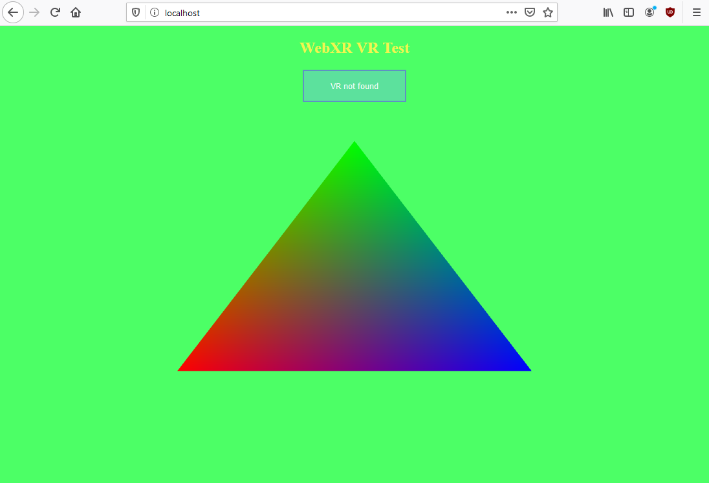
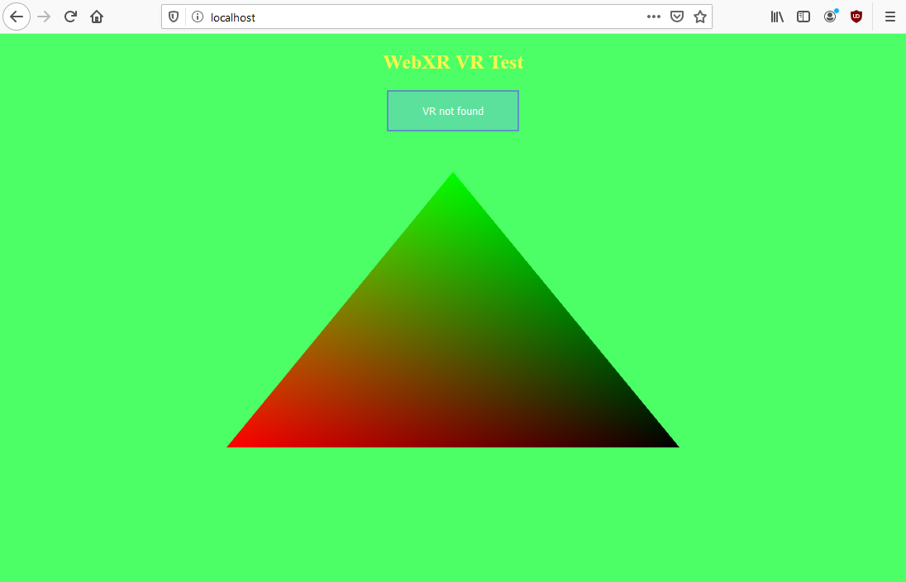
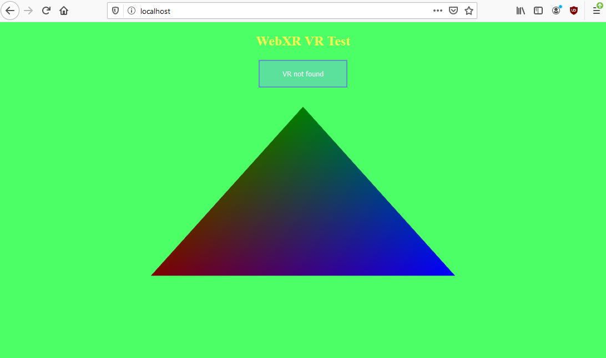

# WebGL 2 basics - Shaders and vertices

## In this tutorial we will abstract our WebGL2 code into classes such as Models and Materials, so that we will not have to look at WebGL2's code anymore.

You might ask - "but why?". Well, the answer lies in *you*. Yes, you, the reader. As I said (or didn't say), I don't expect everyone to know WebGL2, nor understand it from my clunky explanation. Therefore, we're going to make it a little bit easier to use WebGL2 - using abstraction. Instead of writing shaders, we will simply define a material, instead of creating vertex buffers and vertex arrays, we're just gonna create a model. Simple as that. If you didn't understand my explanation of WebGL2 - you are welcome to enjoy this tutorial, or just go ahead and read the summary of the code written, copy it and paste into your project. I assure you, we will not use almost any WebGL2 concept later on in the tutorial series - we're gonna concentrate on WebXR and the possibilities it provides.

But first - let's get a little comfy with GLSL and vertex layouts. In previous episode we defined a vertex layout that only lets us define positions of vertices, which we used in our vertex shaders to position the vertices on the screen. But what if we want our vertices to contain more, than just information about their position? Let's say we want to assign a special color to every single one of our vertices.
```js
const vertexData = [ // a simple triangle in the middle of the screen, with different colors per every vertex
	-0.5, -0.5, // position 0
	1.0, 0.0, 0.0, 1.0, // color 0
	0.0, 0.5, // position 1
	0.0, 1.0, 0.0, 1.0, // color 1
	0.5, -0.5, // position 2
	0.0, 0.0, 1.0, 1.0 // color 2
];
```

Now our left-bottom vertex will be red, middle-top vertex will be green and right-bottom vertex will be blue. All of the pixels in between them will interpolate between these colors, making up for a nice gradient. But first we need to tell our vertex array that the vertex layout is now different, instead of just one vertex position made out of 2 floats:
```js
gl.vertexAttribPointer(
	0, // the location of our vertex layout element, in this case it will be zero, as it's the first one
	2, // how much data this vertex layout element contains, in this case there are 2 floats per point, so that's what we say here
	gl.FLOAT, // what type the data is, as i said, these are floats
	false, // tells WebGL if it should normalize this data (modify it accordingly to the types limitations, to make it a float), when working with floats we don't have to do this, so we say false
	2 * 4, // this specifies a stride, or a size in bytes of one vertex. In our case the full vertex only takes up two floats, so we say two times size (in bytes) of float, which is four.
	0 // this is an offset, it tells us how far away (in bytes) this vertex layout element is from the start of the vertex
);
gl.enableVertexAttribArray(0); // we tell WebGL that we have the first vertex layout location allocated in this vertex array
```

We now have vertices made out of a vertex position taking up two floats, and a vertex color, taking up four floats:
```js
// Vertex Position
gl.vertexAttribPointer(
	0, // the location of our vertex layout element, in this case it will be zero, as it's the first one
	2, // how much data this vertex layout element contains, in this case there are 2 floats per point, so that's what we say here
	gl.FLOAT, // what type the data is, as i said, these are floats
	false, // tells WebGL if it should normalize this data (modify it accordingly to the types limitations, to make it a float), when working with floats we don't have to do this, so we say false
	6 * 4, // this specifies a stride, or a size in bytes of one vertex. In our case the full vertex takes up 6 floats (2 for positions, and 4 for colors), and every float is 4 bytes..
	0 // this is an offset, it tells us how far away (in bytes) this vertex layout element is from the start of the vertex
);
gl.enableVertexAttribArray(0); // we tell WebGL that we have the first vertex layout location allocated in this vertex array
// Vertex Color
gl.vertexAttribPointer(
	1, // the location of our vertex layout element, in this case it will be one, as it's the second element of a vertex
	4, // how much data this vertex layout element contains, in this case there are 4 floats per color, so that's what we say here
	gl.FLOAT, // what type the data is, as i said, these are floats
	false, // tells WebGL if it should normalize this data (modify it accordingly to the types limitations, to make it a float), when working with floats we don't have to do this, so we say false
	6 * 4, // this specifies a stride, or a size in bytes of one vertex. In our case the full vertex takes up 6 floats (2 for positions, and 4 for colors), and every float is 4 bytes..
	2 * 4 // this is an offset, it tells us how far away (in bytes) this vertex layout element is from the start of the vertex, here it's 2 floats away, which basically means we're skipping the vertex position here
);
gl.enableVertexAttribArray(1); // we tell WebGL that we have the second vertex layout location allocated in this vertex array
```

The last thing to do, is to make our vertex shader accept this vertex element as input, and pass it into our fragment shader, so that it will be able to color every pixel accordingly.
```js
const vertexShaderCode = "#version 300 es\nprecision mediump float;\n" + // These will have to appear in every shader we write, they set the version of GLSL that's used, and the floating point number's precision, in this case medium
"layout(location = 0) in vec2 a_Position;" + // This takes in the first element of our vertex, in this case it's the vertex's position
"layout(location = 1) in vec4 a_Color;" + // This takes in the second element of our vertex, in this case it's the vertex's color
"void main() {" + // we specify our main function, here we will do all the maths and things
	"gl_Position = vec4(a_Position, 0.0, 1.0);" + // the only thing we do in this shader, is that we set our point's position to be the vertex position we specified
"}"; 
```

So here we take in the color in our shader, but how do we pass it into the fragment shader? Well it's actually pretty simple, for that we use varyings. In older GLSL's they were defined using the `varying` keyword, but now it's deprecated and we have to use `out` and `in` keywords instead. They define what data comes out of the shader, and what data comes into it. Like when vertex data comes into vertex shader, or pixel color comes out of the fragment shader. This also applies for passing data between shaders, we output it from the vertex shader, and then input it in the fragment shader. So let's do it:
```js
const vertexShaderCode = "#version 300 es\nprecision mediump float;\n" + // These will have to appear in every shader we write, they set the version of GLSL that's used, and the floating point number's precision, in this case medium
"layout(location = 0) in vec2 a_Position;" + // This takes in the first element of our vertex, in this case it's the vertex's position
"layout(location = 1) in vec4 a_Color;" + // This takes in the second element of our vertex, in this case it's the vertex's color

"out vec4 v_Color;" + // this defines a new varying variable, that will be passed into the fragment shader, it's named v_Color, as it stands for "varying color"

"void main() {" + // we specify our main function, here we will do all the maths and things
	"gl_Position = vec4(a_Position, 0.0, 1.0);" + // the only thing we do in this shader, is that we set our point's position to be the vertex position we specified
	"v_Color = a_Color;" + // varying variable has to be set to some value, in this case the value is simply our vertex's color 
"}"; 
// Also remember that the vertex shader runs per vertex

const fragmentShaderCode = "#version 300 es\nprecision mediump float;\n" + // as i said, we have to put it into every shader we write
"layout(location = 0) out vec4 o_Color;" + // as and output of the fragment shader we specify the fragment's (pixel's) color.

"in vec4 v_Color;" + // we have to take in our varying variable color

"void main() {" + // again, all the maths and operations go here
	"o_Color = v_Color;" + // we simply set the fragment's color to be our varying color
"}";
// And keep in mind that the fragment shader runs per fragment (pixel)
```

Now if we run our website, we should see a triangle that looks like this:


Now we know that:
1. We can pass more than one variable per vertex - we don't have to limit ourselves to only vertex positions, we can pass anything we want!
2. When we pass a variable from the vertex shader to the fragment shader, it's value is going to be interpolated to fit how close the pixel is to which vertex.

The second rule is presented in a very good manner by our example. As you can see, the colors interpolate between themselves, depending on how close they are to corresponding vertices.
Now, as we know (or as we will learn), the values can be modified by us in any way we want. We can multiply colors, add them toghever, substract them, do anything we want. Let's go ahead and try doing it:
```js
const fragmentShaderCode = "#version 300 es\nprecision mediump float;\n" + // as i said, we have to put it into every shader we write
"layout(location = 0) out vec4 o_Color;" + // as and output of the fragment shader we specify the fragment's (pixel's) color.

"in vec4 v_Color;" + // we have to take in our varying variable color

"void main() {" + // again, all the maths and operations go here
	"o_Color = v_Color * vec4(1.0, 1.0, 0.0, 1.0);" + // we set the fragment's color to be our varying color multiplied by yellow
"}";
```

Now, if we run our app, we should see something like this:


As we can see, the part which was blue is now black, why is that? Well, it's because we multiplied red and green by one (which means we kept them), while multiplying blue by zero, which means that we basically got rid of blue. :D

Now, let's see what happens if we try to darken our red and green, but keep the blue the same:
```js
const fragmentShaderCode = "#version 300 es\nprecision mediump float;\n" + // as i said, we have to put it into every shader we write
"layout(location = 0) out vec4 o_Color;" + // as and output of the fragment shader we specify the fragment's (pixel's) color.

"in vec4 v_Color;" + // we have to take in our varying variable color

"void main() {" + // again, all the maths and operations go here
	"o_Color = v_Color * vec4(0.5, 0.5, 1.0, 1.0);" + // we set the fragment's color to be our varying color, but with half of it's red, half of it's green and it's full blue
"}";
```

Now, if we run our app, we should see something like this:


What happened here? Exactly what we asked for - our reds and greens have been made darker, while blue was kept the same.

I'd highly suggest you to play around with different operations - adding/substracting/dividing instead of multiplying, and with different values.
In the next episode we're going to be talking about `uniforms`, which are values that you pass into your shaders per program instead of per vertex.


You can check out the project's files [here](https://github.com/beProsto/webxr-tutorial/tree/master/projects/tutorial4)!

Next: [WebGL 2 basics - Matrices and 3D](tutorial5)
Previous: [WebGL 2 basics - A simple triangle](tutorial3)

<div GITHUB_API_ID="4"></div>

