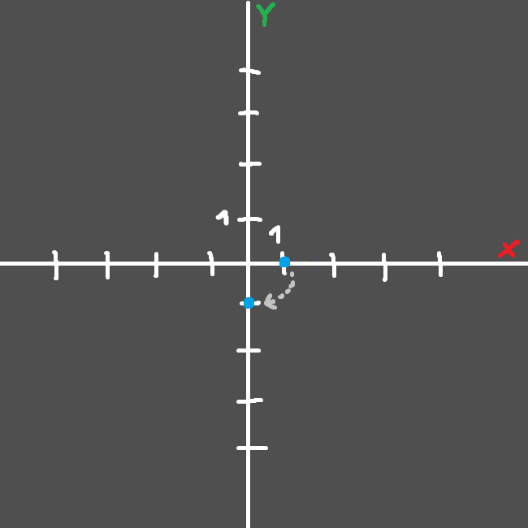
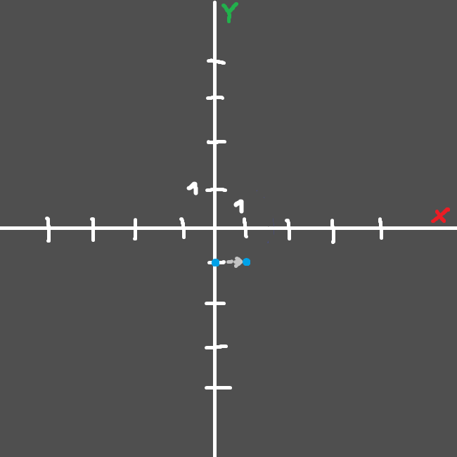

# Matrices and 3D graphics

## Don't worry - in the next episode we'll start learning WebXR. For now, we have to teach ouselves a little bit about graphics programming 101.

Of course I'm not going to teach you everything about mathematics behind the concept of matrices, for that we have [these](https://www.youtube.com/watch?v=3BAY6smfXx4&list=PLZMkqlPED79zp6E6Je9ZksqaIqJ55ZlyV). I'm going to briefly present you with an idea of what they are and what can they do.

So, in this series we will be dealing with 4 dimensional matrices, or 4x4 matrices as normal people would call them. Why these? Well it's because of their purpose. 

3x3 Matrices are perfect for transforming (rotating around an axis, scaling from a point, repositioning) a point. The 4th row and column in 4x4 matrices are used in a different manner - to not do transformations, but projections (operations that make a point in one coordinate system be positioned in a way that makes sense in another coordinate system) instead.

They do it by keeping an order of operations:
```js
... * ThirdMatrix * SecondMatrix * FirstMatrix * Point;
```

Which means that this:
```js
final = Matrix4.Translate(1.0, 0.0, 0.0) * Matrix4.RotateZ(90.0) * Vector3(1.0, 0.0, 0.0)
```

Will result in our point being first rotated 90 degrees around the Z axis, which would change it's position from `x:1.0,y:0.0,z:0.0` to `x:0.0,y:-1.0,z:0.0`:



And after that, our resulting point will be translated by *one* in the x axis, which would make it go from `x:0.0,y:-1.0,z:0.0` to `x:1.0,y:-1.0,z:0.0`:



Which means that we would in total go from `x:1.0,y:0.0,z:0.0` to `x:1.0,y:-1.0,z:0.0`. We could also pre-multiply the matrices toghever, this has a couple of pros: 
- If we don't modify the values used in these matrices, we will be able to reuse the same pre-multiplied matrix a couple times, which would mean that we will save lots of compute time that would normally be spent on multiplying them.
- In some occasions it looks nicer in code.
- In some occasions we can't pass individual matrices - like here. Our `Model` matrix has to contain everything: rotations, translations, scaling... `View` and `Projection` matrices are used for different purposes - we can't use them for storing these.

And this is how doing the same operation looks like if we pre-multiply the matrices:
```js
model = Matrix4.Translate(1.0, 0.0, 0.0) * Matrix4.RotateZ(90.0)
final = model * Vector3(1.0, 0.0, 0.0)
```

As you see it does the same thing, but `model` acts as some kind of middle-ground between our matrices and our point.
So yeah - now let's get to `view` and `projection` thingies:

View matrices are done using almost the same methods as the Model matrices are done, but instead of dictating of point's transformation, they dictate our camera's transformation. It's done using unique methods of inversing a matrix - We setup our transformation matrix normally, and then inverse it, giving us camera transformation. Here's how it would look like in code:
```js
view = Matrix4.Translate(1.0, 0.0, 0.0) * Matrix4.RotateZ(90.0)
view = Matrix4.Inverse(view)
final = view * Vector3(1.0, 0.0, 0.0)
```

So essentially, it would do the same thing our previous example did, but because of the `Inverse` part, it will actually do the exact opposite with that point in the same order. This is exactly what inverse does. And as you may thik, it's perfect for positioning and rotating cameras in games.

The worst thing I will have to explain here is projection, essentially it is used to translate positions in one coordinate system to another. There are two main types of projection: `Orthographic` and `Perspective`. `Orthographic` lets you define your bounds of the coordinate system you want, whilst `Perpective` lets you specify the `field of view`, based on which it simulates the perspective view of the world (we see the world in a perspective view, the easiest way to describe it is: the further objects are, the smaller they seem).

Perspective projection simply makes the points closer to the center of the screen basing on how far they are in the `z` axis, and the specified `field of view`.

To reset all operations on our matrices, we simply set them to `identity`. `Identity` is the matrices' equivalent of a vector set to zero. `Identity` matrices don't modify anything at all. This is how they are defined:
```js
identity = Matrix4([
	1.0, 0.0, 0.0, 0.0,
	0.0, 1.0, 0.0, 0.0,
	0.0, 0.0, 1.0, 0.0,
	0.0, 0.0, 0.0, 1.0
]);
```

As you can see identity matrices are created by making a matrix filled with zeroes, that has a diagonal line of ones coming through it.
As you might've noticed, this is exactly the matrix we used in the previous article to set our `Projection`, `View` and `Model` matrices. 
It simply means that they were set not to modify anything in our vertex positions. 

Everything I've shown you up until this point in this tutorial was made up of pseudo-code and had nothing to do with actual functions that are present in JavaScript or any JavaScript library. My reasoning is simple; we don't need any matrix math library for now, because WebXR will handle everything we'll need for now. When we get into experimenting, and more advanced stuff we will start to use some kind of a library for it, for now, we just don't need to.

Still, the knowledge from this tutorial applies, as we will need it in the future, it's useful, helpful and let's you understand what are you even doing. :D

And in the next article we're going to setup a simple WebXR scene. Yes - we're finally going to see something in VR! And - we're going to finally put our `VR not found` button to use!

Next: Coming Soon!
Previous: [A simple WebGL 2 abstraction](tutorial3)

<div GITHUB_API_ID="4"></div>

