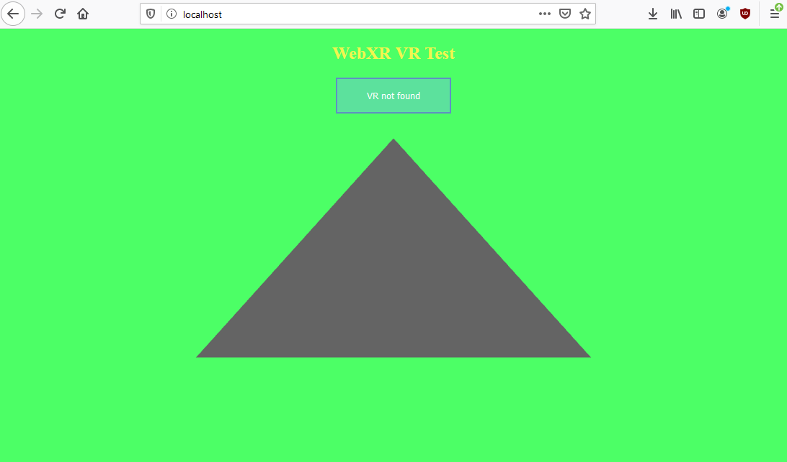
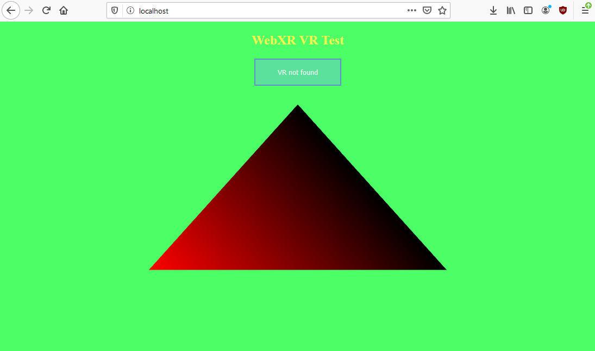
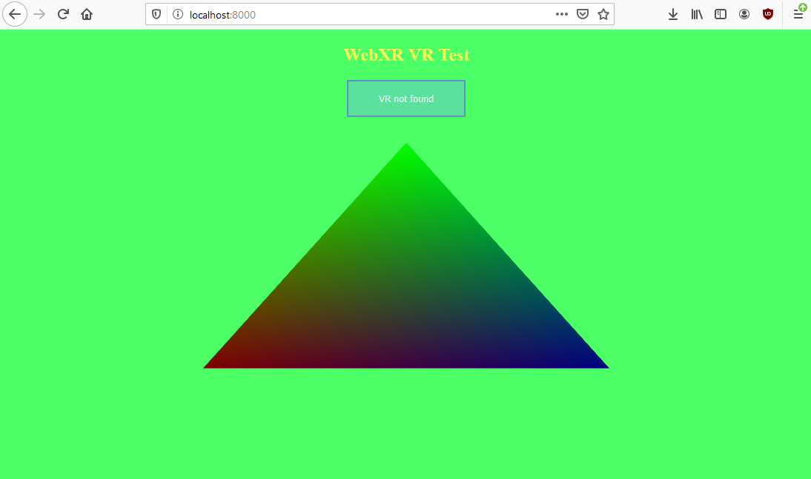

# WebGL 2 basics - Matrices and 3D

## We're going to go over to the topics presented in the title, but first we have to learn about something very important.

And that important thing is named `uniform`. Uniforms are variables that are passed into our shaders once per program. Which means that they are the values that influence every vertex/fragment in the same way, therefore there is absolutely no reason to pass them per vertex. Another reason to use them is the fact that they are a lot easier to assign and modify, because rather than having to upload a modified version of our vertex data for every update of this variable, we just simply pass in the variable itself. Which means that they are easily modifiable, and we can even modify them every frame.

So how do we implement these "uniforms". Let's say that we'd like a uniform that will be a color, by which every single one of our fragment shader's colors will be multiplied. We'd propably go about implementing it like this:
```js
const fragmentShaderCode = "#version 300 es\nprecision mediump float;\n" + // as i said, we have to put it into every shader we write
"layout(location = 0) out vec4 o_Color;" + // as and output of the fragment shader we specify the fragment's (pixel's) color.

"in vec4 v_Color;" + // we have to take in our varying variable color

"uniform vec4 u_Color;" + // we specify that we want to take in an uniform variable named u_Color

"void main() {" + // again, all the maths and operations go here
	"o_Color = v_Color * u_Color;" + // we set the fragment's color to be our varying color, but multiplied by our uniform color
"}";
```

As you can see, we implement these using the `uniform` keyword, just like varyings were implemented using `varying` keyword in the old days.
But if we run our website now, all that we'll see is a black/transparent triangle:


Why is that? Well - it's because we didn't set our uniform yet - so it uses default values, which are just zeroes everywhere.
Let's say we want to set it so it will only see red - just pass in `{r: 1.0, g: 0.0, b: 0.0, a: 1.0}`. And to do it in our javascript code, we'll have to:
1. Get the uniform's location
2. Set the uniform based on that location

We find the uniform location using the `gl.getUniformLocation` function. It takes in the program and the uniform's name as arguments. So we'll call it like this: `gl.getUniformLocation(program, "u_Color");`. Simple, right? Well, now we have to set the uniform. For that we have a couple functions:
- `gl.uniform1f` - for single floats
- `gl.uniform2f` - for two floats (a two element float vector)
- `gl.uniform3f` - for three floats (a three element float vector)
- `gl.uniform4f` - for four floats (a four element float vector)

Well, actually there's a bit more, but we'll worry about them later. So to set our color, as it's a four element vector, we'll use `gl.uniform4f`. What arguments does it take in? Well, it takes in the uniform location, and four floats, each representing another element of the vector. Let's try and code it:
```js
gl.useProgram(program); // we bind our program
const colorUniformLocation = gl.getUniformLocation(program, "u_Color"); // we get our uniform's location
gl.uniform4f(colorUniformLocation, 1.0, 0.0, 0.0, 1.0); // we set the color uniform to red
gl.useProgram(null); // we unbind our program
```

Oh, and if you haven't figured it out yet - it doesn't matter where you put this, just do it after the program was linked.
Now if we check on our website, we should see that our approach worked succesfully, and we only see red and the place of green and blue was taken up by black:


Just like when we did it the last time in the shader, here we also can play around with it, for instance set it to a more appealing combination of colors, for instance `0.5, 1.0, 0.5, 1.0`:


