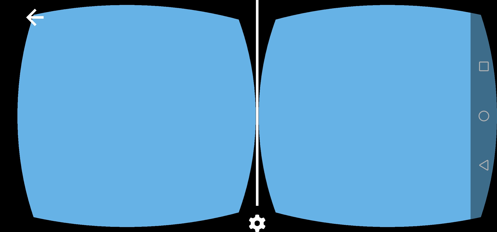

# WebXR Initialization

## In this article, after setting everything else up, we're finally going to start doing WebXR.

We have to first know how our webxr game loop looks like:
1. Init function - Creates a WebGL2 context, checks if starting a VR WebXR session is possible, and if it is, makes the button enabled.
2. Button click event - When button is clicked, it should *start* a new WebXR VR session.
3. Session start event - Specifies what happens when the VR session is started succesfully.
4. Session on frame event - Does exactly what `window.requestAnimationFrame(onFrame)` does, except for your VR display instead of the web browser's window.
5. Session end event - Specifies what happens when the WebXR VR session is ended.

So, now you're propably wondering, "What is this whole `WebXR VR Session` thing?", well - here I come to explain it!
Well, `WebXR Session` is a `WebXR` object that tells us about our session - our gaming session per se.

The `WebXR Session` tells us if the device we're using supports VR, if it can run a VR application and gives us an easy to use interface for running and managing these VR applications.

There are two types of `WebXR Sessions`:
1. `immersive-vr` - for VR applications
2. `immersive-ar` - for AR applications

Of course, because of this tutorial's topic, we're going to concentrate *only* on `immersive-vr` session.

So now, that we've gone over this, let's get to coding.
First of all, we're gonna have to add another init function - it's name will be `initWebXR`. Then, in that same function, we're going to check if our device supports WebXR, and if it does - we're gonna check if `immersive-vr` session is supported, if it is - we're gonna make our button enabled, and able to do something, but we're not gonna tell it what to do just yet.
```js
// XR globals.
let xrButton = document.getElementById("xr-button");
let xrSession = null;
let xrRefSpace = null;

function initWebXR() { // our new init function
	if(navigator.xr) { // checks if our device supports WebXR
		navigator.xr.isSessionSupported("immersive-vr").then((supported) => { // we check if immersive-vr session is supported
			if(supported) { // if it is supported
				xrButton.disabled = false; // enable the button (makes it possible to click it)
				xrButton.textContent = "Enter VR"; // change text on the button
				xrButton.addEventListener("click", onButtonClicked); // add a new event to the button, which will run the onButtonClicked function
			}
		});
	}
}
```

Now, if you got a little confused over this code, take a little bit of time to analyse it, step by step.

Moving on, our button will play a big role in this application, it's job is to start it and (sometimes) end it. Without our button, how would we start our application in an intuitive way? Exactly - we wouldn't. (Not to say that it wouldn't be impossible, just most of the other ways of doing it are simply unpleasant.)

So let's make a function that will handle what happens when our button is pressed:
```js
function onButtonClicked() { // this function specifies what our button will do when clicked
	if(!xrSession) { // if our session is null - if it wasn't created
		navigator.xr.requestSession("immersive-vr").then(onSessionStarted); // request it (start the session), and when the request is handled, call onSessionStarted
	} else { // if our session was started already
		xrSession.end(); // request our session to end
	}
}
```

Now we have to define what happens when our session ends, and what happens when it starts.
But first, we have to modify our `initWebGL2` function a little tiny bit:
```js
function initWebGL2(attributes) {
	canvas = document.createElement("canvas"); // creates a new canvas element ( <canvas></canvas> )
	gl = canvas.getContext("webgl2", attributes || {alpha: false}); // creates a WebGL2 context using the canvas and the given attributes, with an addition of {alpha: false} attribute, which just disables transparency of our canvas
	if(!gl) { // if the gl DIDN'T create properly
		alert("This browser does not support WebGL 2."); // alert the user about it
		return; // go out of the function; stop this function
	}
	canvas.style = "position: absolute; width: 100%; height: 100%; left: 0; top: 0; right: 0; bottom: 0; margin: 0; z-index: -1;"; // we add a simple style to our canvas
	document.body.appendChild(canvas); // appends/adds the canvas element to the document's body
	onResize(); // resizes the canvas (it needs to be done, because otherwise it will not resize until you resize your window)
}
```

And now, after modifying our `initWebGL2` function this way, we can finally initialize it along with our whole WebXR application:
```js
function onSessionStarted(_session) { // this function defines what happens when the session is started
	xrSession = _session; // we set our session to be the session our request created
	xrSession.addEventListener("end", onSessionEnded); // we set what happenes when our session is ended

	initWebGL2({xrCompatible: true}); // we initialize WebGL2, in a way that makes it compatible with WebXR

	xrSession.updateRenderState({baseLayer: new XRWebGLLayer(xrSession, gl)}); // this line simply sets our session's WebGL context to our WebGL2 context
	xrSession.requestReferenceSpace("local").then((refSpace) => { // we request our referance space - an object that defines where the center of our space lies. Here we request a local referance space - that one defines the center of the world to be where player's head is at the start of our application.
		xrRefSpace = refSpace; // we set our referance space to be the one returned by this function
		xrSession.requestAnimationFrame(onSessionFrame); // at this point everything has been set up, so we can finally request an animation frame, on a function with the name of onSessionFrame
	});

	function onSessionFrame(t, frame) { // this function will happen every frame
		const session = frame.session; // frame is a frame handling object - it's used to get frame sessions, frame WebGL layers and some more things
		session.requestAnimationFrame(onSessionFrame); // we simply set our animation frame function to be this function again
	}

	function onSessionEnded() { // this function defines what happens when the session has ended
		xrSession = null; // we set our xrSession to be null, so that our button will be able to reinitialize it when we click it the next time
	}
}
```

We can also request a couple more types of referance spaces, here's a simple, [nice list of them](https://developer.mozilla.org/en-US/docs/Web/API/XRSession/requestReferenceSpace).

As you can see, it's pretty easy to setup an easy WebXR application. Now, I would like to bring your attention a little bit more to the `onSessionFrame` function. For it to work properly in the future, we have to set it up properly now:
```js
function onSessionFrame(t, frame) { // this function will happen every frame
	const session = frame.session; // frame is a frame handling object - it's used to get frame sessions, frame WebGL layers and some more things
	session.requestAnimationFrame(onSessionFrame); // we simply set our animation frame function to be this function again
	let pose = frame.getViewerPose(xrRefSpace); // gets the pose of the headset, relative to the previously gotten referance space

	if(pose) { // if the pose was possible to get (if the headset responds)
		let glLayer = session.renderState.baseLayer; // get the WebGL layer (it contains some important information we need)

		gl.bindFramebuffer(gl.FRAMEBUFFER, glLayer.framebuffer); // sets the framebuffer (drawing target of WebGL) to be our WebXR display's framebuffer
		gl.clearColor(0.4, 0.7, 0.9, 1.0);
		gl.clear(gl.COLOR_BUFFER_BIT | gl.DEPTH_BUFFER_BIT); // clears the framebuffer (in the next episode we'll implement our ezgfx renderer here - for now, let's just use vanilla WebGL2, as we're not doing anything else than clearing the screen)
		for(let view of pose.views) { // we go through every single view out of our camera's views
			let viewport = glLayer.getViewport(view); // we get the viewport of our view (the place on the screen where things will be drawn)
			gl.viewport(viewport.x, viewport.y, viewport.width, viewport.height); // we set our viewport appropriately

			// Here we will draw our scenes
		}
	}
}
```

And at the end of our file, we have to change the call to `initWebGL2` to be a call to `initWebXR`:
```js
initWebXR(); // we call our init function, therefore initializing the application
```

Now, if you did everything correctly, you may still face an issue of the application not working. If your button still says `VR not found`, even tho you are on the device that supports VR (a PC with the headset connected, a mobile phone, an oculus quest, anything), it means that your device doesn't support WebXR. We can fix it fairly easily, simply by implementing the `WebXR Polyfill`. It's fortunately easy to use, you just do this at the start of your file (`index.js` of course):
```js
// Polyfill makes it possible to run WebXR on devices that support only WebVR.
import WebXRPolyfill from "https://cdn.jsdelivr.net/npm/webxr-polyfill@latest/build/webxr-polyfill.module.js";
const polyfill = new WebXRPolyfill();
```

If everything worked correctly, you should see this on your phone after clicking on the `Enter VR` button (if it didn't work out, go ahead and check out the project's files directly):


You can check out the project's files [here](https://github.com/beProsto/webxr-tutorial/tree/master/projects/tutorial5)!

Next: Coming Soon!
Previous: [A simple WebGL 2 abstraction](tutorial4)

<div GITHUB_API_ID="5"></div>

