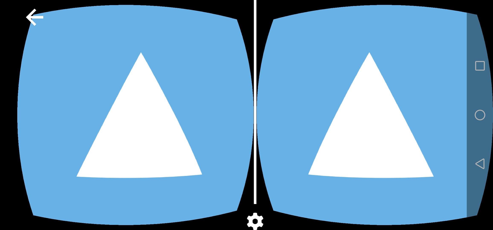
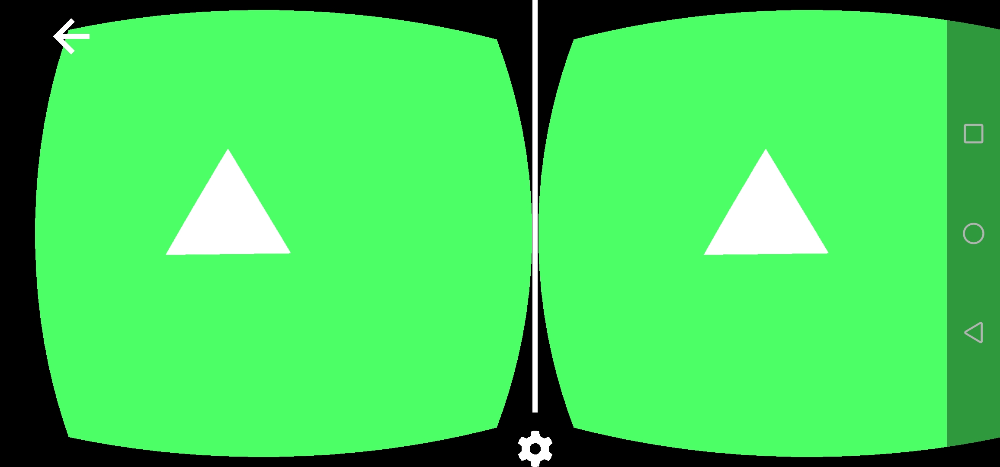

# A simple 3D WebXR scene

## In the last article we learnt how to setup a simple WebXR application, today let's create a simple scene inside of it! 

So the first thing we will do is create all the meshes and materials needed, with our `ezgfx` abstraction, it will be as easy as buttering some bread.

The fist thing to do is creating a renderer:
```js
const renderer = new ezgfx.Renderer();
```

We will put it right after initializing everything, before requesting the referance space, just to be safe.

The same with initializing everything else, for now, let's just create and draw a simple triangle. 
```js
const triangleMesh = new ezgfx.Mesh();
triangleMesh.loadFromData(ezgfxGlobals.triangle);

const triangleMaterial = new ezgfx.Material();
const identityMatrix = new Float32Array([
	1.0, 0.0, 0.0, 0.0,
	0.0, 1.0, 0.0, 0.0,
	0.0, 0.0, 1.0, 0.0,
	0.0, 0.0, 0.0, 1.0
]);
triangleMaterial.setProjection(identityMatrix);
triangleMaterial.setView(identityMatrix);
triangleMaterial.setModel(identityMatrix);
```

And in the place where we had this comment:
```js
// Here we will draw our scenes
```

We will now actually draw the triangle:
```js
renderer.draw(triangleMesh, triangleMaterial);
```

And if we run our application, this is what we should see:


Now, you can see a slight problem here; we seem not to be able to rotate or move around the scene. Well, that's because except for drawing the object, we should also set it's projection and view matrices to the ones given by WebXR. We get our Projection matrix using:
```js
view.projectionMatrix
```

and our view marix using:
```js
view.transform.inverse.matrix
```

Now if instead of just drawing the triangle, we will also set these matrices accordingly:
```js
triangleMaterial.setProjection(view.projectionMatrix);
triangleMaterial.setView(view.transform.inverse.matrix);

renderer.draw(triangleMesh, triangleMaterial);
```

what we should observe is our triangle rotating and positioning correctly depending on our position and orientation.

The last thing to change will be our screen clearing, up until now we did it using WebGL2's native calls:
```js
gl.clearColor(0.4, 0.7, 0.9, 1.0);
gl.clear(gl.COLOR_BUFFER_BIT | gl.DEPTH_BUFFER_BIT); // clears the framebuffer (in the next episode we'll implement our ezgfx renderer here - for now, let's just use vanilla WebGL2, as we're not doing anything else than clearing the screen)
```

We'll just change it to clearing using our `ezgfx` renderer:
```js
renderer.clear([0.3, 1.0, 0.4, 1.0]);
```

Coming back to the triangle, you might observe our camera is actually inside the of it. To make it all look a little bit better, we should push our triangle forward by, let's say 3 units. To achieve it, we will create a special **model** matrix for our triangle.
```js
const triangleModelMatrix = new Float32Array([
	1.0, 0.0, 0.0, 0.0,
	0.0, 1.0, 0.0, 0.0,
	0.0, 0.0, 0.0, 0.0,
	0.0, 0.0, -3.0, 1.0 // the first element of this row is for x position, the second for y and the third for z, which means we just offset it by negative three on the z axis
]);
```

And now we will just set it as our triangle's model matrix:
```js
triangleMaterial.setModel(triangleModelMatrix);
```

Now we should see our triangle like this:

