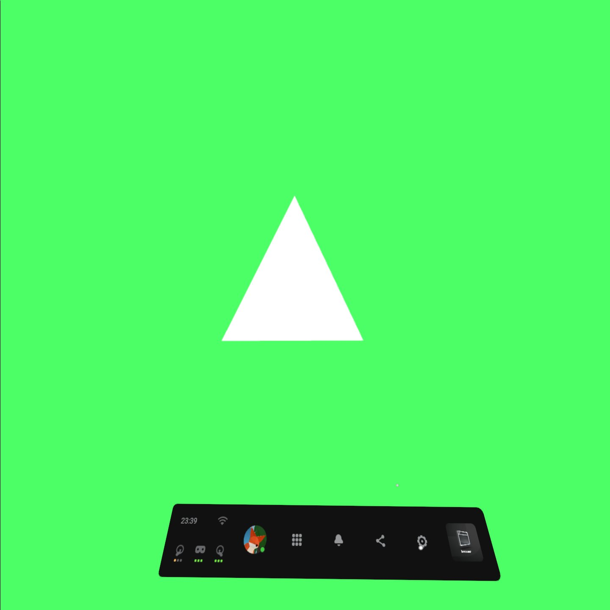

# A simple 3D WebXR scene

## In the last article we learnt how to setup a simple WebXR application, today let's create a simple scene inside of it! 

So the first thing we will do is create all the meshes and materials needed, with our `ezgfx` abstraction, it will be as easy as buttering some bread.

The fist thing to do is creating a renderer:
```js
const renderer = new ezgfx.Renderer();
```

We will put it right after initializing everything, before requesting the referance space, just to be safe.

The same with initializing everything else, for now, let's just create and draw a simple triangle. 
```js
const triangleMesh = new ezgfx.Mesh();
triangleMesh.loadFromData(ezgfxGlobals.triangle);

const triangleMaterial = new ezgfx.Material();
const identityMatrix = new Float32Array([
	1.0, 0.0, 0.0, 0.0,
	0.0, 1.0, 0.0, 0.0,
	0.0, 0.0, 1.0, 0.0,
	0.0, 0.0, 0.0, 1.0
]);
triangleMaterial.setProjection(identityMatrix);
triangleMaterial.setView(identityMatrix);
triangleMaterial.setModel(identityMatrix);
```

And in the place where we had this comment:
```js
// Here we will draw our scenes
```

We will now actually draw the triangle:
```js
renderer.draw(triangleMesh, triangleMaterial);
```

And if we run our application, this is what we should see:


Now, you can see a slight problem here; we seem not to be able to rotate or move around the scene. Well, that's because except for drawing the object, we should also set it's projection and view matrices to the ones given by WebXR. We get our Projection matrix using:
```js
view.projectionMatrix
```

and our view marix using:
```js
view.transform.inverse.matrix
```

`view.transform` returns an [XRRigidTransform](https://developer.mozilla.org/en-US/docs/Web/API/XRRigidTransform), which is an object that contains data about position and orientation of a transform. Using `XRRigidTransform.matrix` we would get a normal matrix made using the given position and orientation, but `XRRigidTransform.inverse.matrix` will return an inversed matrix, which, as we know from the last article, is the one we will want to use in case of a `view` matrix.

Now if instead of just drawing the triangle, we will also set these matrices accordingly:
```js
triangleMaterial.setProjection(view.projectionMatrix);
triangleMaterial.setView(view.transform.inverse.matrix);

renderer.draw(triangleMesh, triangleMaterial);
```

what we should observe is our triangle rotating and positioning correctly depending on our position and orientation.

The last thing to change will be our screen clearing, up until now we did it using WebGL2's native calls:
```js
gl.clearColor(0.4, 0.7, 0.9, 1.0);
gl.clear(gl.COLOR_BUFFER_BIT | gl.DEPTH_BUFFER_BIT); // clears the framebuffer (in the next episode we'll implement our ezgfx renderer here - for now, let's just use vanilla WebGL2, as we're not doing anything else than clearing the screen)
```

We'll just change it to clearing using our `ezgfx` renderer:
```js
renderer.clear([0.3, 1.0, 0.4, 1.0]);
```

Coming back to the triangle, you might observe our camera is actually inside the of it. To make it all look a little bit better, we should push our triangle forward by, let's say 3 units. To achieve it, we will create a special **model** matrix for our triangle.
```js
const triangleModelMatrix = new Float32Array([
	1.0, 0.0, 0.0, 0.0,
	0.0, 1.0, 0.0, 0.0,
	0.0, 0.0, 0.0, 0.0,
	0.0, 0.0, -3.0, 1.0 // the first element of this row is for x position, the second for y and the third for z, which means we just offset it by negative three on the z axis
]);
```

And now we will just set it as our triangle's model matrix:
```js
triangleMaterial.setModel(triangleModelMatrix);
```

Now we should see our triangle like this:


And just for the sake of testing, I tried it on my oculus quest (the navigation bar is there because I had to open it to take the screenshot):


When trying your applications out on the quest, remember to connect through [ngrok](https://ngrok.com/)'s https forwarding.


It's one thing to create a scene with a triangle, but a completely other one to create an actually nice 3D scene. So let's build one! For that we'll need some kind of a 3D modelling tool, like [blender](https://www.blender.org).

Using blender, I created two meshes: a plane, and a cube. I didn't modify them or anything, I just exported them as OBJ files:


Then, we set it's destination to be our project's folder, set these settings like that and click `Export OBJ`:


Be sure to check the `Triangulate Faces` checkbox, as we need all faces to be triangles here. 

So now we've got two OBJ 3D model files, containing a plane, and a cube. For convenience I named these files `"cube.obj"` and `"plane.obj"`. (If you don't feel like modelling, you can just download them from project files.)

In our code, we'll delete all the triangle stuff, and create `cube` and `plane` meshes, and `cube` and `plane` materials. Then we'll draw them.
```js
// After setting up the renderer
renderer.depthTesting(true); // if you don't know what that means - it means that our meshes will be rendered properly ¯\_(ツ)_/¯

const identityMatrix = new Float32Array([
	1.0, 0.0, 0.0, 0.0,
	0.0, 1.0, 0.0, 0.0,
	0.0, 0.0, 1.0, 0.0,
	0.0, 0.0, 0.0, 1.0
]); // just an identity matrix - will not modify anything

const planeMesh = new ezgfx.Mesh();
planeMesh.loadFromOBJ("/plane.obj");

const planeMaterial = new ezgfx.Material();
planeMaterial.setProjection(identityMatrix);
planeMaterial.setView(identityMatrix);
planeMaterial.setModel(identityMatrix);

planeMaterial.setColor([0.5, 0.5, 0.5, 1.0]); // we haven't done this one yet - it's responsible for setting the color in which our object will be drawn (at start it's set to white)

const cubeMesh = new ezgfx.Mesh();
cubeMesh.loadFromOBJ("/cube.obj");

const cubeMaterial = new ezgfx.Material();
cubeMaterial.setProjection(identityMatrix);
cubeMaterial.setView(identityMatrix);
cubeMaterial.setModel(identityMatrix);

cubeMaterial.setColor([0.4, 0.3, 1.0, 1.0]);

// After setting the viewport (in the place where we should draw)
sceneMaterial.setProjection(view.projectionMatrix);
sceneMaterial.setView(view.transform.inverse.matrix);

renderer.draw(sceneMesh, sceneMaterial);

cubeMaterial.setProjection(view.projectionMatrix);
cubeMaterial.setView(view.transform.inverse.matrix);

renderer.draw(cubeMesh, cubeMaterial);
```

But, with that approach, you'll see a couple problems. First of all, the floor is at the same level as our head and we're inside the cube.
Let's fix being inside the cube using a custom translation (position) matrix:
```js
const offsetMatrix = new Float32Array([
	1.0, 0.0, 0.0, 0.0,
	0.0, 1.0, 0.0, 0.0,
	0.0, 0.0, 1.0, 0.0,
	-2.0, 1.0, -5.0, 1.0
]);
cubeMaterial.setModel(offsetMatrix);
```

And now, let's fix our `floor on the head level` problems. There are a couple ways to approach this issue, the best one will be to just use a `local-floor` referance space instead of a `local` one. It will set our world's origin to be the ground and not the head's starting position.

So to implement our `local-floor` referance space, first we'll have to set it as a required feature by our session. That's how we should do it:
```js
navigator.xr.requestSession("immersive-vr", {requiredFeatures: ["local-floor"]}).then(onSessionStarted); // request it (start the session), and when the request is handled, call onSessionStarted
```

We simply put that in the place where we normally requested our session. Then, we'll just request a `local-floor` referance space:
```js
xrSession.requestReferenceSpace("local-floor").then((refSpace) => { // we request our referance space - an object that defines where the center of our space lies. Here we request a local-floor referance space - that one defines the center of the world to be where the center of the ground is
	xrRefSpace = refSpace; // we set our referance space to be the one returned by this function

	xrSession.requestAnimationFrame(onSessionFrame); // at this point everything has been set up, so we can finally request an animation frame, on a function with the name of onSessionFrame
});
```

As you see, these two changes made a world of difference, if we check on our application now, that's what we should see:


To have a little fun, we'll do some shading on these. How - you might ask - well, it's pretty simple; we'll have to write a custom fragment shader. Don't you worry - it will be very straight forward.

You can check out the project's files [here](https://github.com/beProsto/webxr-tutorial/tree/master/projects/tutorial6)!

Next: [Finding the controllers](tutorial7)
Previous: [WebXR Initialization](tutorial5)

<div GITHUB_API_ID="6"></div>

