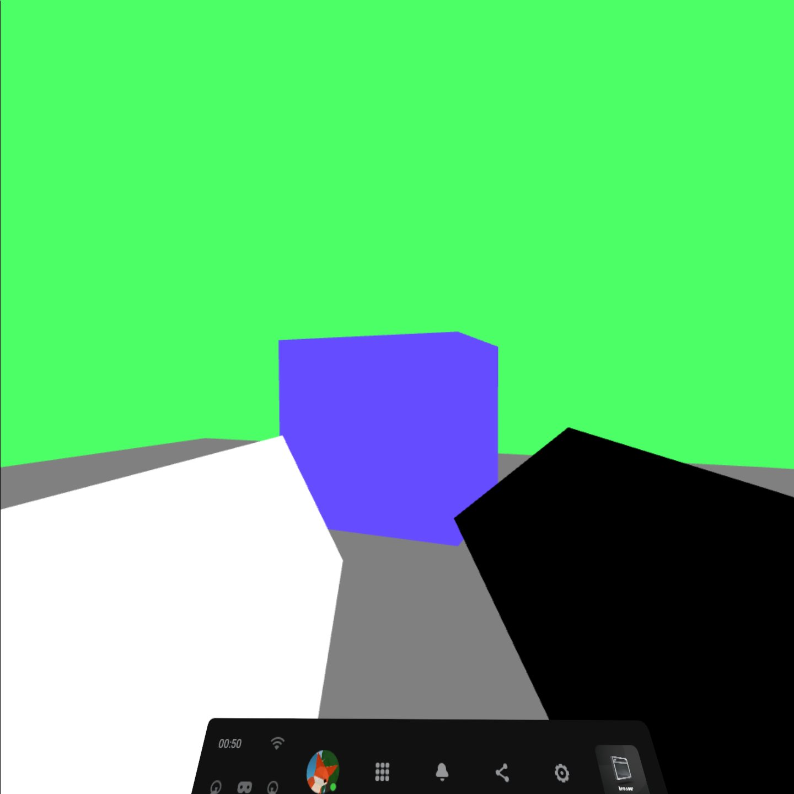

# Finding the controllers

## In previous episodes we did stuff that was easy to achieve and test using your phone, in this one, we'll do something that we will only be able to test if we have a headset that supports motion controllers.

So we know how to setup a nice 3D scene, but how about making it a little bit more interactive? Of course, it's possible to achieve that without controllers, I'm just trying to find any reason for their existance, whereas we all know it's all about more interactivity and *immersion*.

In this article we're going to find out where our controllers are, what is their model matrix, and which hand do they belong to. In the next one, we're going to take a look at reading button/joystick input from our controllers.

So first, let's define how we will try to find the controllers. We're going to do that by looping through every controller our session caught. Let's define a function to deal with that:
```js
let controllers = {};
function onControllerUpdate(session, frame) { // this function will be called every frame, before rendering
	for(let inputSource of session.inputSources) { // we loop through every input source (controller) caught by our session
	
	}
}
```

Now let's get the `pose` of our controller (XRPose is a WebXR object containing the transform of an object, relative to a space (sometimes referance space)). For that we will need to get our controller's `space`, and get a pose out of it, by comparing it to our referance space. 
```js
let controllers = {};
function onControllerUpdate(session, frame) { // this function will be called every frame, before rendering
	for(let inputSource of session.inputSources) { // we loop through every input source (controller) caught by our session
		if(inputSource.gripSpace) { // we check if our controllers actually have their space
			let gripPose = frame.getPose(inputSource.gripSpace, xrRefSpace); // we get controller's pose, by comparing our controller's space to our referance space
			if(gripPose) { // we check if our controller's pose was gotten correctly
				// handle controllers
			}
		}
	}
}
```

The last thing that will come into play will be our `controllers` object. It will contain data about our controllers using objects inside of it. There should only really be two, one named `left`, and another one named `right`. 
```js
let controllers = {};
function onControllerUpdate(session, frame) { // this function will be called every frame, before rendering
	for(let inputSource of session.inputSources) { // we loop through every input source (controller) caught by our session
		if(inputSource.gripSpace) { // we check if our controllers actually have their space
			let gripPose = frame.getPose(inputSource.gripSpace, xrRefSpace); // we get controller's pose, by comparing our controller's space to our referance space
			if(gripPose) { // we check if our controller's pose was gotten correctly
				controllers[inputSource.handedness] = {}; // inputSource.handedness returns a string representing in which hand we have our controller - that is "left" or "right"
			}
		}
	}
}
```

For now let's just make these elements contain one element each - that will be our controller's pose. Let's see how to do that:
```js
let controllers = {};
function onControllerUpdate(session, frame) { // this function will be called every frame, before rendering
	for(let inputSource of session.inputSources) { // we loop through every input source (controller) caught by our session
		if(inputSource.gripSpace) { // we check if our controllers actually have their space
			let gripPose = frame.getPose(inputSource.gripSpace, xrRefSpace); // we get controller's pose, by comparing our controller's space to our referance space
			if(gripPose) { // we check if our controller's pose was gotten correctly
				controllers[inputSource.handedness] = {pose: gripPose}; // inputSource.handedness returns a string representing in which hand we have our controller - that is "left" or "right". Which means that controllers.left and controllers.right will from now on contain an element named "pose", which will simply be their corresponding XRPose
			}
		}
	}
}
```

Now, all we have to do is to call this function inside of our loop:
```js
// ...
if(pose) { // if the pose was possible to get (if the headset responds)
	let glLayer = session.renderState.baseLayer; // get the WebGL layer (it contains some important information we need)

	onControllerUpdate(session, frame); // update the controllers' state

	gl.bindFramebuffer(gl.FRAMEBUFFER, glLayer.framebuffer); // sets the framebuffer (drawing target of WebGL) to be our WebXR display's framebuffer
		
	renderer.clear([0.3, 1.0, 0.4, 1.0]);
// ...		
```

We can test if everything works fine by modelling some kind of a simple stretched cube.
Now let's just implement it by creating a mesh that will load up the model, and creating a material for it.
```js
const controllerMesh = new ezgfx.Mesh();
controllerMesh.loadFromOBJ("/controller.obj");

const controllerMaterial = new ezgfx.Material();
controllerMaterial.setProjection(identityMatrix);
controllerMaterial.setView(identityMatrix);
controllerMaterial.setModel(identityMatrix);
```

For now we're not setting the color, that will change depending on which controller we're rendering so I'll just leave it unset at the start.

Now, before rendering the controller we will have to check if it even exists, so we just do a simple if statement:
```js
if(controllers.left) { // checks if WebXR got our left controller

}
if(controllers.right) { // checks if WebXR got our right controller

}
```

Now let's render our controllers inside of these:
```js
if(controllers.left) { // checks if WebXR got our left controller
	controllerMaterial.setProjection(view.projectionMatrix);
	controllerMaterial.setView(view.transform.inverse.matrix);
	controllerMaterial.setModel(controllers.left.pose.transform.matrix); // we just get our model matrix for the controller
	
	controllerMaterial.setColor([1.0, 1.0, 1.0, 1.0]); // color white

	renderer.draw(controllerMesh, controllerMaterial);
}
if(controllers.right) { // checks if WebXR got our right controller
	controllerMaterial.setProjection(view.projectionMatrix);
	controllerMaterial.setView(view.transform.inverse.matrix);
	controllerMaterial.setModel(controllers.right.pose.transform.matrix); // we just get our model matrix for the controller
	
	controllerMaterial.setColor([0.0, 0.0, 0.0, 1.0]); // color black

	renderer.draw(controllerMesh, controllerMaterial);
}
```

And now we should see our big, beefy, black and white minecraft-like hands:



You can check out the project's files [here](https://github.com/beProsto/webxr-tutorial/tree/master/projects/tutorial7)!

Next: Coming Soon!
Previous: [A simple 3D WebXR scene](tutorial6)

<div GITHUB_API_ID="7"></div>

