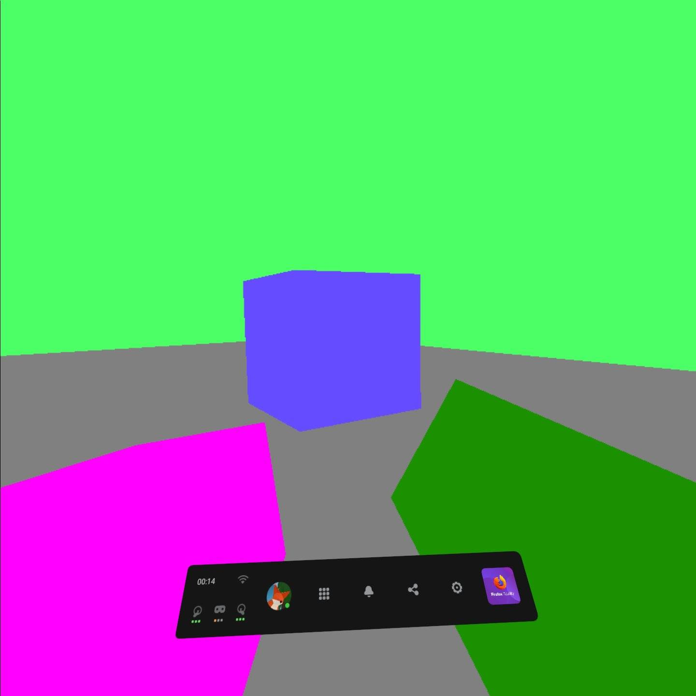

# Reading the controllers' input

## In previous episode we learned how to get controller's transformation and the hand it's in. Now we're going to learn how to get controller input.

Ok, so in this episode we're going to create a system that will give us data about our buttons and joysticks on our controllers. How could we achieve something like this? Well, the WebXR API gives us a nice little solution for this. It's named `gamepad`, it uses the [Gamepad API](https://developer.mozilla.org/en-US/docs/Web/API/Gamepad), and is a part of [XRInputSource](https://developer.mozilla.org/en-US/docs/Web/API/XRInputSource) object.

The `gamepad` object can be taken from an `XRInputSource`, for instance the `inputSource` objects in our controller loop. The `gamepad` object contains data about axes (how far are the joysticks from the center, presented as numbers ranging from `-1` to `1`), buttons (both if they are clicked and how far they are pushed (that's used for the analog buttons, like `grab` or `trigger`))

Let's jump into the code and see for ourselves how we can use this knowledge:
```js
function onControllerUpdate(session, frame) { // this function will be called every frame, before rendering
	for(let inputSource of session.inputSources) { // we loop through every input source (controller) caught by our session
		if(inputSource.gripSpace) { // we check if our controllers actually have their space
			let gripPose = frame.getPose(inputSource.gripSpace, xrRefSpace); // we get controller's pose, by comparing our controller's space to our referance space
			if(gripPose) { // we check if our controller's pose was gotten correctly
				controllers[inputSource.handedness] = {pose: gripPose, gamepad: inputSource.gamepad}; // inputSource.handedness returns a string representing in which hand we have our controller - that is "left" or "right". Which means that controllers.left and controllers.right will contain two elements, one named "pose", which will simply be their corresponding XRPose, and the second named "gamepad", which will contain their corresponding Gamepad object. 
			}
		}
	}
}
```

So we essentially added a new element to our controller's objects. This element is named gamepad, and it will contain the `Gamepad` object.

Let's see how we can if one of the buttons is clicked:
```js
if(controller.left.gamepad.buttons[0].pressed) { // checks if button of index 0 on the left controller is pressed
	// Do something about it
}
```

Let's discuss the components of the `gamepad` object:
- `buttons` - is an array of `GamepadButton` objects
	- `GamepadButton.pressed` - returns `true`, if the button is pressed, and `false` if it isn't.
	- `GamepadButton.value` - returns a `float`, ranging from `0.0` to `1.0`, that represents how far the button is pushed (useful for analog buttons, such as the **trigger** button)
- `axes` - is an array of `float`s ranging from `-1.0` to `1.0`, that represent how far the **analog sticks** on the controller are pushed on the individual axes.

This is which axes and buttons represent which axes and buttons on the `oculus quest`:
- `X` axis for the analog stick - `gamepad.axes[2]`
- `Y` axis for the analog stick - `gamepad.axes[3]`
- `TRIGGER` button - `gamepad.buttons[0]`
- `GRAB` button - `gamepad.buttons[1]`
- `X`/`A` button - `gamepad.buttons[4]`
- `Y`/`B` button - `gamepad.buttons[5]`

So now, that we know what each of these mean and what they are, let's do something with them, for instance, let's set the color of our hands depending on how much are some of our buttons pressed:
```js
// when drawing our left controller
const red = controllers.left.gamepad.buttons[0].value; // left controller's trigger's value
const green = controllers.left.gamepad.buttons[1].value; // left controller's grab's value
const blue = controllers.left.gamepad.buttons[4].value; // left controller's X button's value
controllerMaterial.setColor([red, green, blue, 1.0]); // color white

// when drawing the right controller
const red = controllers.right.gamepad.buttons[0].value; // left controller's trigger's value
const green = controllers.right.gamepad.buttons[1].value; // left controller's grab's value
const blue = controllers.right.gamepad.buttons[4].value; // left controller's A button's value
controllerMaterial.setColor([red, green, blue, 1.0]); // color black
```

Nice, so now, if we press our buttons, our arms will change their colors.

Let's do some more testing, for instance let's make moving around our big scene a little bit easier. For that we will use our left controller's axes. First let's just add our analog stick's `x` value to our position's `x`, and do the same for the analog stick's `y` and our position's `z`.
```js
// after every controllers' update
xrRefSpace = xrRefSpace.getOffsetReferenceSpace(new XRRigidTransform({x: controllers.left.gamepad.axes[2], y: 0.0, z: controllers.left.gamepad.axes[3]})); // we offset our reference space by our analog stick's position
```

This approach works, but not as expected - when we turn, our joysticks forward will suddenly not be our forward, therefore we have to implement some kind of a "cheat" that will let us tell where the player wants to go. For that we will use the rotation of our controller. Which means, that our "forward" will be the direction in which our controller is facing.

First, let's make it easier for ourselves to get the forward direction, by creating a function that will apply all the matrix operations to a specific vector:
```js
// this function multiplies a 4d vector by a 4x4 matrix (it applies all the matrix operations to the vector)
function mulVecByMat(out, m, v) {
	out[0] = m[0] * v[0] + m[1] * v[1] + m[2] * v[2] + m[3] * v[3];
	out[1] = m[4] * v[0] + m[5] * v[1] + m[6] * v[2] + m[7] * v[3];
	out[2] = m[8] * v[0] + m[9] * v[1] + m[10] * v[2] + m[11] * v[3];
	out[3] = m[12] * v[0] + m[13] * v[1] + m[14] * v[2] + m[15] * v[3];
}
```

So now, that we have a way of getting our controller's front and center, when multiplying two different points by our controller's matrix, let's use it to change our player's position (offset our reference space):
```js
// we get our controller's center and front
let front = [0.0, 0.0, 0.0, 1.0];
let center = [0.0, 0.0, 0.0, 1.0];

let matrix = controllers.left.pose.transform.matrix;

mulVecByMat(front, matrix, [0.0, 0.0, -1.0, 1.0]);
mulVecByMat(center, matrix, [0.0, 0.0, 0.0, 1.0]);

// we convert front and center into the direction
let xDir = front[0] - center[0];
let zDir = front[1] - center[1];
xDir = -xDir;

// we normalize the direction
const l = Math.sqrt(xDir * xDir + zDir * zDir);
xDir = xDir / l;
zDir = zDir / l;

// we set our offsets up, this will include both the direction of the controller and the direction of our analog sticks
let xOffset = controllers.left.gamepad.axes[3] * xDir + controllers.left.gamepad.axes[2] * zDir;
let zOffset = controllers.left.gamepad.axes[3] * zDir - controllers.left.gamepad.axes[2] * xDir;

// we slow it down a little bit, so that it will not make us nauseous once we move 
xOffset *= 0.1; 
zOffset *= 0.1;

// we offset our reference space
xrRefSpace = xrRefSpace.getOffsetReferenceSpace(new XRRigidTransform({x: xOffset, y: 0.0, z: zOffset})); 
```

And our final result is being able to move around the scene!



You can check out the project's files [here](https://github.com/beProsto/webxr-tutorial/tree/master/projects/tutorial8)!

Previous: [Finding the controllers](tutorial7)

<div GITHUB_API_ID="8"></div>

