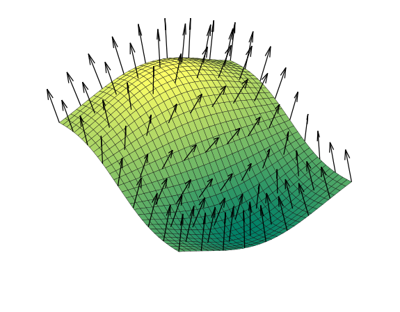

# Experimenting with lighting

## This article will be a kind of an experiment itself. I wanna get a little funky with lighting before we go onto something as important as 3D sound (because yes - that's what I'm planning for the next episode).

Let's start with creating a directional light. If you don't know what that is - it's a light that shines equally from the same direction on all of the objects in the scene. We can call it the video game's equivalent of sun.

So how does one go about doing this whole directional lighting thing? Well, it's actually quite simple. You see - Our meshes are made out of triangles, every triangle has three vertices, or vertexes, which are divided into:
- position - the 3D position, a point, where the vertex is.
- texture coordinate - a 2D point on a scale from 0.0 to 1.0 on both axes, representing which part of the texture our vertices correspond to.
- normal - the thing we're interested in. It's simply a vector pointing away from our triangle.

We can deduce how much will our pixel be brighten up by getting it's normal and comparing it against another vector. But where do we get this second vector from and how do we compare them? It's simple - we get the vector by simply predefining it as the direction in which our "sun" glows, and we compare them using something called "the `dot product`".

The dot product works by defining how different, or in how different directions the vectors point. It does it on a scale from 1.0 (identical) to -1.0 (they are pointing into the opposite directions). For our use case we will:
1. Get the dot product between our sunlight direction and the normal.
2. Limit our dot product's result from `1.0` - `-1.0` to just `1.0` - `0.0`.
3. Multiply the end result by our color.

You can check out the project's files [here](https://github.com/beProsto/webxr-tutorial/tree/master/projects/tutorial9)!

Previous: [Reading the controllers' input](tutorial8)

