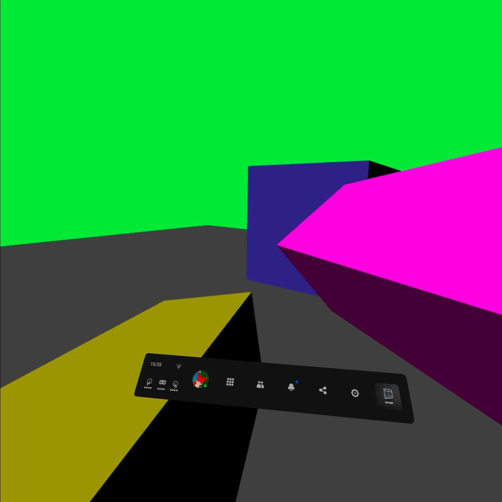

# Experimenting with lighting

## This article will be a kind of an experiment itself. I wanna get a little funky with lighting before we go onto something as important as 3D sound (because yes - that's what I'm planning for the next episode).

Let's start with creating a directional light. If you don't know what that is - it's a light that shines equally from the same direction on all of the objects in the scene. We can call it the video game's equivalent of sun.

So how does one go about doing this whole directional lighting thing? Well, it's actually quite simple. You see - Our meshes are made out of triangles, every triangle has three vertices, or vertexes, which are divided into:
- position - the 3D position, a point, where the vertex is.
- texture coordinate - a 2D point on a scale from 0.0 to 1.0 on both axes, representing which part of the texture our vertices correspond to.
- normal - the thing we're interested in. It's simply a vector pointing away from our triangle.

[](https://en.wikipedia.org/wiki/File:Surface_normals.svg)

We can deduce how much will our pixel be brighten up by getting it's normal and comparing it against another vector. But where do we get this second vector from and how do we compare them? It's simple - we get the vector by simply predefining it as the direction in which our "sun" glows, and we compare them using something called "the `dot product`".

The dot product works by defining how different, or in how different directions the vectors point. It does it on a scale from 1.0 (identical) to -1.0 (they are pointing into the opposite directions). For our use case we will:
1. Get the dot product between our sunlight direction and the normal.
2. Limit our dot product's result from `1.0` - `-1.0` to just `1.0` - `0.0`(in our case we don't have to do so, because every value of an output color that's lower than `0.0` will be set to it, but it's something to keep in mind).
3. Multiply the end result by our color.

So now - let's code it! First, we'll have to modify our shader situation, as it only allows the user to modify the fragment shader. What we'll do is a simple and dirty fix - we'll just let the user modify the vertex shader too.

These are the modifications we'll have to do to our `ezgfx.js` file to make it possible:

First, let's divide the vertex shader's code into 2 halves, between them we will have to define a function called `vertex`.

Let's change this:
```js
ezgfxGlobals.vSS = new ezgl.SubShader(gl.VERTEX_SHADER, "#version 300 es\n\
			precision mediump float;\n\
			\n\
			layout(location = 0) in vec3 a_Position;\n\
			layout(location = 1) in vec2 a_TexCoord;\n\
			layout(location = 2) in vec3 a_Normal;\n\
			\n\
			uniform mat4 u_Projection;\n\
			uniform mat4 u_View;\n\
			uniform mat4 u_Model;\n\
			\n\
			out vec2 v_TexCoord;\n\
			\n\
			void main() {\n\
			gl_Position = u_Projection * u_View * u_Model * vec4(a_Position, 1.0);\n\
				v_TexCoord = a_TexCoord;\n\
				v_TexCoord.y = 1.0 - v_TexCoord.y;\n\
			}");
```

Into this:
```js
ezgfxGlobals.vSSC0 = "#version 300 es\n\
precision mediump float;\n\
\n\
layout(location = 0) in vec3 a_Position;\n\
layout(location = 1) in vec2 a_TexCoord;\n\
layout(location = 2) in vec3 a_Normal;\n\
\n\
uniform mat4 u_Projection;\n\
uniform mat4 u_View;\n\
uniform mat4 u_Model;\n\
\n\
out vec2 v_TexCoord;\n";
ezgfxGlobals.vSSC1 = "\nvoid main() {\n\
	gl_Position = vertex();\n\
	v_TexCoord = texcoord();\n\
	v_TexCoord.y = 1.0 - v_TexCoord.y;\n\
}";
ezgfxGlobals.vSS = new ezgl.SubShader(gl.VERTEX_SHADER, ezgfxGlobals.vSSC0 + "\nvec4 vertex() { return u_Projection * u_View * u_Model * vec4(a_Position, 1.0); }\nvec2 texcoord() { return a_TexCoord; }\n" + ezgfxGlobals.vSSC1);
```

Now after we've modified our shaders this way, we can add a way to write our own vertex and texcoord functions. For that, we modify the Material class constructor:
```js
Material: class {
		constructor(customVertex = null, customTexCoord = null, customShader = null) {
			this.shader = new ezgl.Shader();
			let vSS = null;
			if(!customVertex && !customTexCoord) {
				this.shader.join(ezgfxGlobals.vSS);
			}
			else if(customVertex && customTexCoord) {
				vSS = new ezgl.SubShader(gl.VERTEX_SHADER, ezgfxGlobals.vSSC0 + customVertex + "\n" + customTexCoord + ezgfxGlobals.vSSC1);
				this.shader.join(vSS);
			}
			else if(!customVertex && customTexCoord) {
				vSS = new ezgl.SubShader(gl.VERTEX_SHADER, ezgfxGlobals.vSSC0 + "vec4 vertex() { return u_Projection * u_View * u_Model * vec4(a_Position, 1.0); }\n" + customTexCoord + ezgfxGlobals.vSSC1);
				this.shader.join(vSS);
			}
			else if(customVertex && !customTexCoord) {
				vSS = new ezgl.SubShader(gl.VERTEX_SHADER, ezgfxGlobals.vSSC0 + customVertex + "\nvec2 texcoord() { return a_TexCoord; }" + ezgfxGlobals.vSSC1);
				this.shader.join(vSS);
			}

			if(!customShader) {
				this.shader.join(ezgfxGlobals.fSS);
				this.shader.link();
			}
			else {
				let fSS = new ezgl.SubShader(gl.FRAGMENT_SHADER, ezgfxGlobals.fSSC0 + customShader + ezgfxGlobals.fSSC1); 
				this.shader.join(fSS);
				this.shader.link();
				fSS.free();
			}

			if(vSS) {
				vSS.free();
			}
```

Simple enough, ain't it? So what will happen now is that whenever we create our Material we will be able to choose if we want to write our own vertex, texcoord and pixel (shading) functions. That would be the example of use:
```js
// A material with custom vertex and pixel shading functions
const material = new Material("vec4 vertex() { return u_Projection * u_View * u_Model * vec4(a_Position, 1.0); }", null, "vec4 shader() { return u_Color * vec4(vec3(0.2), 1.0); }"); 
```

Now, that we've done all of this hard prepwork, let's write our lighting shader!
```js
const lightShader = {
	vertex: "\n\
	out float v_Brightness;\n\
	vec4 vertex() {\
		\
		vec3 lightDirection = normalize(vec3(1.0, -1.0, -1.0));\
		\
		vec4 worldPoint = u_Model * vec4(a_Position, 1.0);\
		vec4 worldPointPlusNormal = u_Model * vec4(a_Position + normalize(a_Normal), 1.0);\
		\
		v_Brightness = -dot(normalize(worldPointPlusNormal.xyz - worldPoint.xyz), lightDirection);\
		\
		return u_Projection * u_View * worldPoint;\
	}",
	shader: "\
	in float v_Brightness;\
	vec4 shader() {\
		return vec4(u_Color.rgb * vec3(v_Brightness), 1.0);\
	}"
};
```

Now, let's make all our materials use these shaders:

```js
const planeMaterial = new ezgfx.Material(lightShader.vertex, null, lightShader.shader);
```

```js
const cubeMaterial = new ezgfx.Material(lightShader.vertex, null, lightShader.shader);
```

```js
const controllerMaterial = new ezgfx.Material(lightShader.vertex, null, lightShader.shader);
```

When trying to test this thing out, I ran into a problem: no matter what i would do my phone's screen would always be black. Only after I've done some debugging (as in - frantically put `alert`s everywhere), I realised that the problem wasn't in any of the shaders, but instead in the fact, that I wrote the code in a way that it assumes we have controllers, which is not the case when it comes to mobile phones. Let's fix it real quick:

We have to put an `if` statement that checks if we have the controllers before the code that moves the player **and** before the code that renders the controllers.

First, the movement code:
```js
// we want to let the player move around only if the controller is detected, otherwise we will be trying to use non-existing values, which would crash our application
if(controllers.left) {
	// we get our controller's center and front
	let front = [0.0, 0.0, 0.0, 1.0];
	let center = [0.0, 0.0, 0.0, 1.0];
	let matrix = controllers.left.pose.transform.matrix;

	mulVecByMat(front, matrix, [0.0, 0.0, -1.0, 1.0]);
	mulVecByMat(center, matrix, [0.0, 0.0, 0.0, 1.0]);

	// we convert front and center into the direction
	let xDir = front[0] - center[0];
	let zDir = front[1] - center[1];

	xDir = -xDir;

	// we normalize the direction
	const l = Math.sqrt(xDir * xDir + zDir * zDir);
	xDir = xDir / l;
	zDir = zDir / l;

	// we set our offsets up, this will include boththe direction of the controller and the directionof our analog sticks
	let xOffset = controllers.left.gamepad.axes[3] *xDir + controllers.left.gamepad.axes[2] * zDir;
	let zOffset = controllers.left.gamepad.axes[3] *zDir - controllers.left.gamepad.axes[2] * xDir;

	// we slow it down a little bit, so that it willnot make us nauseous once we move 
	xOffset *= 0.1; 
	zOffset *= 0.1;

	// we offset our reference space
	xrRefSpace = xrRefSpace.getOffsetReferenceSpace(newXRRigidTransform({x: xOffset, y: 0.0, z: zOffset}); 
}
```

And when it comes to the code that renders our controllers - it does check if they were detected, so we don't need to change anything there. :D

If we go on to testing out our application, this is what we should see:


In the next episode we're going to go about doing 3D audio!

You can check out the project's files [here](https://github.com/beProsto/webxr-tutorial/tree/master/projects/tutorial9)!

Previous: [Reading the controllers' input](tutorial8)

<div GITHUB_API_ID="9"></div>

